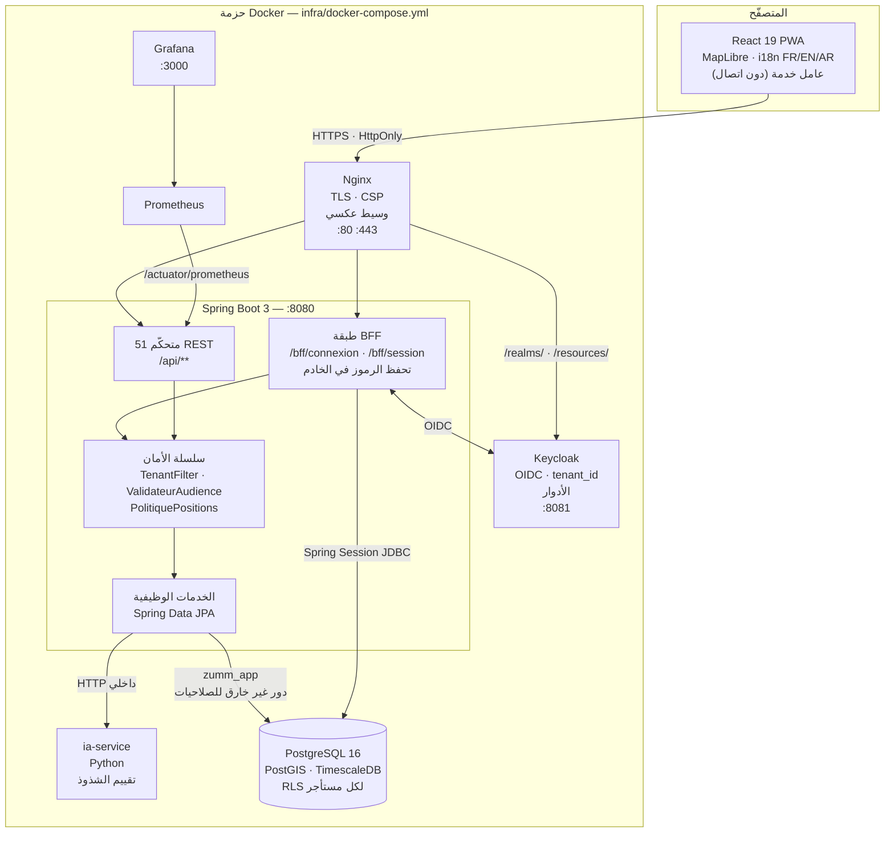

<div dir="rtl">

<p align="center">
  
</p>

<h1 align="center">Zümm (زُمّ)</h1>

<p align="center"><em>نظام معلومات جغرافي لإدارة تربية النحل ومتابعتها</em></p>

<p align="center">
  <a href="https://github.com/iyednefzi99/Z-mm/actions/workflows/ci.yml"></a>
  <a href="https://github.com/iyednefzi99/Z-mm/actions/workflows/build-pdfs.yml"></a>
  
  
</p>

<p align="center">
  <a href="README.md">Français</a> · <a href="README.en.md">English</a> · <strong>العربية</strong>
</p>

---

## ١. نظرة عامة

‏Zümm تطبيق ويب متعدّد المستأجرين يدير مَنحلة من طرفها إلى طرفها: أين توجد الخلايا، مَن
يزورها، ماذا تُنتج، ومتى تبدأ في التدهور.

النحّال المحترف اليوم يتابع مناحله في دفاتر ورقية وجداول متفرّقة: الموقع الدقيق للمنحل
معرفة شفوية، وتقارير الزيارة لا تصل أبدًا، والطائفة المتدهورة تُكتشف بعد فوات الأوان.
يستبدل Zümm هذا الوضع بمرجع واحد مُخرَّط على الخريطة، تُغذّيه المعاينات الميدانية
والمستشعرات، مع تنبيهات تُحذّر قبل وقوع الخسارة.

يجمع المستودع **التطبيق** (خادم Spring Boot، تطبيق React من نوع PWA، خدمة ذكاء اصطناعي
مصغّرة، بنية تحتية بـ Docker) **والمخرجات الهندسية** التي تبرّره: كرّاس الشروط ثلاثي
اللغة، خارطة طريق Scrum/DevOps، مرجع التصميم، وسجلّ قرارات المعمارية.

## ٢. الميزات

**الميدان وقطيع الخلايا**

- تسجيل الضيعات والمناحل والخلايا وتركيبها (صناديق التربية، العاسلات، الإطارات)، مع
  تاريخ الملكات وعمليات التبديل.
- تعبئة تقرير زيارة مع صور، ثم تصديره بصيغة PDF. بطاقة المعاينة **مُهيكَلة** —
  الحضنة، المؤونة، البيوت الملكية، الطبع — وتميّز «لم يُلاحَظ» عن «لا».
- تخطيط الجولات، إسناد الأعوان، والمصادقة على الجدول أو رفضه من قِبل مسؤول.
- العمل **دون اتصال**: يحتفظ التطبيق بما أُدخل ويعيد إرساله عند عودة الشبكة.

**السجلّ الصحّي**

- تسجيل العلاجات بمنتَجها ومادّتها الفعّالة وجرعتها **ووحدتها** وفترة الأمان — تحسب
  القاعدة نهاية فترة الأمان، وتُقرأ في شاشة واحدة قائمةُ الخلايا التي لا يجوز جنيها
  اليوم.
- تسجيل التغذية، مع التمييز بين المحلول ١:١ والمحلول ٢:١: فليسا لغرض واحد.
- عدّ الفاروا باللوح اللاصق أو بالعيّنة. المعدّل **لا يُخزَّن**: وحدته تختلف باختلاف
  الطريقة، فيُحسب — مع وحدته وقراءته — حيث يمكن شرحه.
- تسمية الأمراض الملاحَظة أثناء الزيارة مع درجة خطورتها، بدل تركها في نصّ حرّ.

**الخرائط**

- عرض المناحل على خريطة، البحث عن المواقع القريبة من نقطة، وكشف التجمّعات والجوارات
  المتنافسة.
- تُعاد إحداثيات GPS **مُرشَّحة حسب الدور**: الموقع الدقيق للمنحل معطى حسّاس (سرقة
  الخلايا).

**الإنتاج والتتبّع**

- تسجيل عمليات الجني، تكوين دفعات التعليب، وتتبّع الدفعة رجوعًا إلى الخلايا التي أتت
  منها.
- توليد نصّ البطاقة القانونية للدفعة ورمز QR للتتبّع.

**الإشراف والتنبيهات**

- استيعاب قياسات المستشعرات (الوزن، الحرارة، الرطوبة) كسلاسل زمنية، مع تجميع يومي.
- كشف الشذوذ عبر خدمة Python مصغّرة، مع الرجوع إلى كشف EWMA محلّي عند غياب الخدمة.
- تنبيهات صحّية، تذكيرات بالمهام، ولوحات قيادة للملخّص والإنتاج والتوقّعات.

**التشغيل متعدّد المستأجرين**

- فصل صارم بين الضيعات، مفروض **من قِبل قاعدة البيانات** (RLS في PostgreSQL)، لا من
  قِبل شيفرة التطبيق وحدها.
- أربعة أدوار وظيفية — `apiculteur` و`superviseur` و`responsable` و`admin` — إضافةً إلى
  دور `capteur` المحصور في استيعاب القياسات.
- التسجيل برمز دعوة، سجلّ تدقيق، وتصدير CSV.
- واجهة **ثلاثية اللغة** بالفرنسية والإنجليزية والعربية، مع دعم كامل للاتجاه من اليمين
  إلى اليسار في العربية.

## ٣. الحزمة التقنية

| التقنية | دورها في المشروع |
|---|---|
| **Spring Boot 3.5** (JDK 17) | واجهة REST، الطبقة الوظيفية، الأمان. Spring MVC + Spring Data JPA. |
| **PostgreSQL 16 + PostGIS + TimescaleDB** | نسخة واحدة. يحمل PostGIS الاستعلامات المكانية (القرب، التجمّعات، الجوار)؛ ويحمل TimescaleDB جدول القياسات الزمني (hypertable). |
| **Flyway** | 31 ترحيلة مُرقَّمة — يُعاد بناء المخطّط مطابقًا من الصفر. |
| **Keycloak** | مزوّد هوية OIDC. يُصدر الرموز، ويحمل الأدوار ومطالبة `tenant_id`. |
| **Spring Session JDBC** | جلسات BFF على الخادم: لا يتلقّى المتصفّح سوى كعكة `HttpOnly`، ولا يتلقّى رمزًا أبدًا. |
| **React 19 + TypeScript + Vite** | تطبيق PWA للعميل. موجّه داخلي (ADR-005)، بلا `react-router`. |
| **MapLibre GL** | عرض المناحل على الخريطة، بخلفيات OpenStreetMap. |
| **springdoc-openapi** | يولّد عقد OpenAPI 3.1 من الشيفرة؛ ويشتقّ `openapi-typescript` منه أنواع الواجهة — ويفشل التكامل المستمر إذا تباعد الاثنان. |
| **Python 3.12، المكتبة القياسية** (`ia-service`) | تقييم الشذوذ منفصلًا عن سلاسل القياسات. ملف `requirements.txt` فارغ عن قصد: لا تبعية خارجية تُتابَع ما دام المحرّك إحصائيًا. |
| **Nginx** | وسيط عكسي، إنهاء TLS، ترويسات الأمان وسياسة CSP. |
| **Prometheus + Grafana** | مقاييس Micrometer المعروضة عبر Actuator، ولوحات قيادة تشغيلية. |
| **Testcontainers** | اختبارات تكامل على PostgreSQL/PostGIS **حقيقي**، لا على قاعدة في الذاكرة. |
| **JaCoCo** | تغطية مدمجة للوحدات والتكامل، بحدّين مانعين عند 80٪ (تعليمات) و60٪ (فروع). |

## ٤. المعمارية

<div dir="ltr">



</div>

**مسار الطلب في جملة واحدة:** لا يحمل المتصفّح سوى كعكة جلسة؛ يمرّر Nginx الطلب إلى
طبقة BFF التي تربط الجلسة بالرمز المحفوظ في الخادم؛ يتحقّق `ValidateurAudience` من
المُصدِر *ومن* الجمهور، ويشترط `TenantFilter` وجود مطالبة `tenant_id` (وإلا أجاب
بـ 403) ويدفعها إلى جلسة PostgreSQL؛ عندئذٍ تُرشِّح RLS الصفوف **داخل قاعدة البيانات**،
تحت دور غير خارق للصلاحيات لا يستطيع الالتفاف عليها.

## ٥. بنية المشروع

<div dir="ltr">

```
Zümm/
├── backend/                  Spring Boot API (Maven)
│   └── src/main/
│       ├── java/…/controller/    51 REST + 2 BFF
│       ├── java/…/domain/        44 JPA entities
│       ├── java/…/service/
│       ├── java/…/tenant/        TenantFilter
│       ├── java/…/securite/      PolitiquePositions
│       ├── java/…/config/        SecurityConfig, ValidateurAudience
│       ├── java/…/web/           DTO, pagination, idempotence
│       └── resources/db/migration/  31 Flyway (V1 → V31)
├── frontend/                 React 19 + TypeScript PWA (Vite)
│   └── src/
│       ├── vues/                 business screens
│       ├── ui/                   modal, toasts, SVG charts
│       ├── api/                  openapi.json + generated types
│       ├── auth/  routage/       BFF session, in-house router
│       ├── offline/              replay queue
│       └── i18n/locales/         FR / EN / AR
├── ia-service/               Python anomaly detection
├── infra/                    docker-compose, Nginx, Keycloak, Prometheus, Grafana
├── config/                   ConfigZumm.example.ini
├── scripts/                  demarrer.ps1, check-sync.sh, check-pdf-current.sh
├── docs/                     dev guide, security, SOLID, product strategy
├── cahier de charge/{fr,en,ar}/
├── roadmap/
├── design/
└── assets/logo/
```

</div>

| المجلّد | مسؤوليته |
|---|---|
| `backend/` | واجهة Spring Boot: المتحكّمات، الخدمات الوظيفية، سلسلة الأمان، ترحيلات Flyway. |
| `frontend/` | تطبيق PWA: الشاشات الوظيفية، المكوّنات المشتركة، طابور إعادة الإرسال، موارد اللغات. |
| `ia-service/` | خدمة Python مصغّرة لكشف الشذوذ. |
| `infra/` | حزمة Docker، الوسيط العكسي، مزوّد الهوية، الإشراف. |
| `docs/` | دليل التطوير، الأمان، مبادئ SOLID، استراتيجية المنتج، النماذج الأوّلية. |
| `cahier de charge/` | كرّاس الشروط ثلاثي اللغة (LaTeX ← 3 ملفات PDF). |
| `roadmap/` | خارطة طريق Scrum/DevOps والمصادر التشغيلية وسجلّ ADR. |
| `design/` | مرجع التصميم بالفرنسية والإنجليزية والعربية، ورموز DTCG. |

## ٦. التركيب والتشغيل

### المتطلّبات المسبقة

| الأداة | الإصدار | التحقّق |
|---|---|---|
| JDK | 17 فما فوق | `java -version` |
| Docker Engine / Desktop | العفريت يعمل | `docker info` |
| Node.js | 20 فما فوق | `node -v` |

‏Maven غير مطلوب: المستودع يتضمّن `backend/mvnw`.

### الاستنساخ والإعداد

<div dir="ltr">

```bash
git clone https://github.com/iyednefzi99/Z-mm.git
cd Z-mm
cp .env.example .env
```

</div>

يوجد ملف `.env` **في الجذر**، لا في `infra/`. كل كلمات السرّ معلَنة إجبارية: ترفض
الحزمة الإقلاع بدونها بدل الرجوع إلى قيمة يسهل تخمينها.

| المتغيّر | إجباري | القيمة الافتراضية | الدور |
|---|---|---|---|
| `DB_PASSWORD` | نعم | — | الدور المالك `zumm`: ترحيلات Flyway (DDL) وقاعدة Keycloak. |
| `DB_APP_USER` | نعم | `zumm_app` | دور التطبيق غير الخارق للصلاحيات، تُنشئه الترحيلة V3. |
| `DB_APP_PASSWORD` | نعم | — | كلمة سرّ دور التطبيق. يتّصل التطبيق عبره حتى تكون RLS فعّالة. |
| `KC_ADMIN_USER` | نعم | `admin` | لوحة إدارة Keycloak. |
| `KC_ADMIN_PASSWORD` | نعم | — | كلمة سرّ مدير Keycloak. |
| `GRAFANA_PASSWORD` | نعم | — | واجهة Grafana. |
| `SPRING_PROFILES_ACTIVE` | لا | `dev` | ملمح Spring: `dev` أو `prod`. |
| `ZUMM_BFF_CLIENT` | لا | `zumm-bff` | عميل Keycloak السرّي الذي تستعمله طبقة BFF. |
| `ZUMM_BFF_SECRET` | لا | `secret-bff-dev` | سرّ عميل BFF. **يُعاد توليده في الإنتاج** (`openssl rand -base64 32`) ويُطابَق في الـ realm. |
| `ZUMM_OIDC_ISSUER_URI` | لا | عنوان Keycloak الداخلي | في الإنتاج: العنوان **العمومي** لـ Keycloak — الذي تحمله الرموز الصادرة للمتصفّح. |
| `ZUMM_IA_URL` | لا | `http://ia-service:8000` | خدمة كشف الشذوذ. **إفراغ** المتغيّر يعطّل الاقتران: رجوع إلى كشف EWMA المحلّي، بلا خطأ. |
| `POSTGRES_IMAGE` | لا | صورة PostGIS+TimescaleDB المحلّية | هدف الإنتاج: `timescale/timescaledb-ha:pg16-ts2.14`. |

### تشغيل الحزمة كاملة

هناك متطلّبان **غير مُدرَجين في المستودع** ويجب إنتاجهما مرّة واحدة، وإلا رفض `postgres`
و`nginx` الإقلاع: صورة PostgreSQL المحلّية (القيمة الافتراضية لـ `POSTGRES_IMAGE`)
وشهادة TLS للتطوير.

<div dir="ltr">

```bash
docker build -f infra/test-postgres.Dockerfile -t zumm/test-postgres:16 infra/
bash infra/generer-certificat-dev.sh
docker compose --env-file .env -f infra/docker-compose.yml up -d --build
```

</div>

على Windows، يقوم `Demarrer-Zumm.cmd` (بنقرة مزدوجة) بالشيء نفسه عبر
`scripts/demarrer.ps1`: يوقظ Docker Desktop، ويرفع الحاويات، وينتظر أن يجيب
`/actuator/health` بـ `UP`، ثم يفتح المتصفّح.

| الخدمة | العنوان |
|---|---|
| التطبيق (عبر Nginx) | `https://localhost` |
| Keycloak | `http://localhost:8081` |
| Grafana | `http://localhost:3000` |

### التطوير دون الحزمة

<div dir="ltr">

```bash
# Backend — API on http://localhost:8080
cd backend && ./mvnw spring-boot:run

# Frontend — http://localhost:5173, proxies /api and /actuator to :8080
cd frontend && npm install && npm run dev
```

</div>

### قاعدة البيانات

لا خطوة يدوية: **تطبّق Flyway الترحيلات الثمانَ عشرةَ عند الإقلاع**، فتُنشئ دور التطبيق
وسياسات RLS وامتداد PostGIS وجدول TimescaleDB الزمني. للبدء من الصفر:

<div dir="ltr">

```bash
docker compose --env-file .env -f infra/docker-compose.yml down -v
```

</div>

## ٧. الاستعمال

1. **تسجيل الدخول** على `https://localhost`. ترسل شاشة الدخول بيانات الاعتماد إلى طبقة
   BFF — لا تمرّ أبدًا عبر العنوان، ولا يصل أي رمز إلى المتصفّح.
2. **إنشاء حساب**، عند الاقتضاء، برمز ضيعة: هو ما يربط الحساب الجديد بضيعته. بدون رمز
   صالح يُرفض التسجيل — لا يُنضمّ إلى مستأجر بالصدفة.
3. **التصريح بالقطيع** بهذا الترتيب: ضيعة ← موقع (منحل) ← خلايا ← تركيب. موقع المنحل
   يغذّي الخريطة مباشرةً.
4. **إجراء زيارة**: فتح خلية، تعبئة التقرير، إرفاق صور، وتصدير ملف PDF
   (`GET /api/visites/{id}/rapport.pdf`).
5. **تخطيط جولة**: يُسند المسؤول الأعوان، فيذهب الجدول إلى المصادقة، ويجده العون على
   هاتفه — حتى خارج تغطية الشبكة.
6. **متابعة الإنتاج**: تسجيل عمليات الجني، تكوين الدفعات، والحصول على سلسلة التتبّع
   (`/api/recoltes/tracabilite/{lot}`) ونصّ البطاقة القانونية.
7. **الإشراف**: تُظهر لوحات القيادة (الملخّص، الإنتاج، التوقّعات، التنبيهات الصحّية)
   وشذوذ القياسات كلَّ ما يتدهور.

ما تراه يتوقّف على دورك: `apiculteur` يقرأ المرجع ويُدخل الزيارات والقياسات وعمليات
الجني؛ و`superviseur` يضيف المصادقة على الجداول؛ و`responsable` يُنشئ ويحذف المناحل
والخلايا والأعوان والضيعات، ويطّلع على سجلّ التدقيق ورموز الدعوة؛ و`admin` له المدى
نفسه في القمّة. الرمز الصالح **بلا دور وظيفي** لا يبلغ أي نقطة نهاية.

## ٨. لمحة عن المنتج

لا عرض حيّ على الإنترنت: الحزمة مُعدّة للتشغيل محلّيًا (القسم ٦).

<!-- TODO — لقطات الشاشة: تُلتقط أوّلًا، ثم يُزال التعليق عن الجدول أدناه.
     المقاس 1440×900، السمة الفاتحة، على مجموعة العرض التوضيحي
     (المستأجر `exploitation-demo`)، بلا أي بيانات حقيقية:
       docs/screenshots/tableau-de-bord.png  الملخّص والإنتاج والتنبيهات
       docs/screenshots/carte.png            المناحل والخلايا على MapLibre
       docs/screenshots/visite.png           تعبئة تقرير زيارة
       docs/screenshots/hors-ligne.png       شريط دون اتصال وطابور إعادة الإرسال
       docs/screenshots/rtl-ar.png           الواجهة بالعربية، اتجاه كامل من اليمين

     الجدول يُستعاد كما هو، ويُنعكس في README.md و README.en.md :

     | لوحة القيادة | خريطة المناحل |
     |:-:|:-:|
     |  |  |
-->

في انتظار ذلك، تُتصفَّح النماذج الأوّلية الساكنة بصيغة HTML دون تشغيل أي شيء:
[`docs/maquettes/`](docs/maquettes/) — روزنامة الأعوان، تقرير الزيارة، خريطة المناحل.

## ٩. توثيق الواجهة البرمجية

تعرض الواجهة **140 مسارًا / 202 عملية** وفق OpenAPI 3.1. العقد **مولَّد من الشيفرة**
ومُدرَج في [`frontend/src/api/openapi.json`](frontend/src/api/openapi.json)؛ ويفشل
التكامل المستمر إذا تباعدت الشيفرة والعقد.

- الواجهة التفاعلية: `http://localhost:8080/swagger-ui.html`
- العقد الخام: `http://localhost:8080/v3/api-docs`

يفترض العنوانان **الوصول المباشر إلى الخادم** (`./mvnw spring-boot:run`). ضمن حزمة
Docker الكاملة، المنفذ 8080 غير منشور، ولا يمرّر Nginx سوى `/api/` و`/bff/`
و`/actuator/` و`/oauth2/` و`/login/` ومسارات Keycloak: فواجهة Swagger غير معروضة هناك
— فهي أداة تطوير لا سطح إنتاج.

**الاستيثاق.** كل مسارات `/api/**` تشترط جلسة موثَّقة (كعكة `HttpOnly`) و**دورًا
وظيفيًا واحدًا على الأقل**. ويجب أن يحمل الرمز الكامن مطالبة `tenant_id`، وإلا أجاب
المرشِّح بـ `403`. أمّا مسارات `/bff/**` فهي مدخل الهوية العمومي.

### مسارات الهوية

| الفعل | المسار | الاستيثاق | الجسم / الوسائط | الجواب |
|---|---|---|---|---|
| `POST` | `/bff/connexion` | لا شيء | `{ identifiant, motDePasse }` | `204` مع كعكة جلسة. `401` عند بيانات اعتماد خاطئة — دون الكشف عن وجود الحساب؛ `403` إذا كان الحساب موقوفًا؛ `503` إذا تعذّر بلوغ مزوّد الهوية |
| `POST` | `/bff/inscription` | لا شيء | `{ nom, courriel, motDePasse, code }` | `201`. `422` إذا كان رمز الضيعة مجهولًا أو كلمة السرّ مرفوضة؛ `409` إذا كان البريد مستعملًا |
| `GET` | `/bff/session` | كعكة | — | الهوية الحالية والأدوار والمستأجر؛ `401` خارج الجلسة |

### أمثلة ممثِّلة

| الفعل | المسار | الأدوار المطلوبة | الوسائط | الجواب |
|---|---|---|---|---|
| `GET` | `/api/info` | **لا شيء** (عمومي) | ترويسة `Accept-Language` | هوية التطبيق، مترجَمة |
| `GET` | `/api/ruches` | أي دور وظيفي | ترقيم الصفحات | خلايا المستأجر الحالي |
| `POST` | `/api/ruches` | `responsable`، `admin` | خلية | `201` مع الخلية المُنشأة |
| `POST` | `/api/visites` | أي دور وظيفي | تقرير زيارة | `201` مع الزيارة المُنشأة |
| `GET` | `/api/visites/{id}/rapport.pdf` | أي دور وظيفي | — | ملف PDF للتقرير |
| `GET` | `/api/sites/proches` | أي دور وظيفي | `lat`، `lon`، `rayon` | المواقع ضمن النطاق، **بإحداثيات مُرشَّحة حسب الدور** |
| `GET` | `/api/sites/grappes` | أي دور وظيفي | — | تجمّعات المناحل (تجميع PostGIS) |
| `POST` | `/api/mesures` | `capteur` **أو** أي دور وظيفي | قياس مستشعر | `201`، كتابة مُتماثلة في الجدول الزمني |
| `GET` | `/api/mesures/journalier` | أي دور وظيفي | مجال تواريخ، خلية | سلسلة مُجمَّعة يوميًا |
| `GET` | `/api/anomalies` | أي دور وظيفي | — | الشذوذ المكتشَف (خدمة الذكاء الاصطناعي أو رجوع EWMA) |
| `POST` | `/api/plannings/{id}/approuver` | `superviseur`، `responsable`، `admin` | — | جدول مُصادَق عليه |
| `GET` | `/api/recoltes/tracabilite/{lot}` | أي دور وظيفي | — | سلسلة تتبّع الدفعة |
| `GET` | `/api/tableaux/synthese` | أي دور وظيفي | — | مؤشّرات لوحة القيادة |
| `GET` | `/api/audit` | `responsable`، `admin` | مرشِّحات | سجلّ التدقيق |
| `POST` | `/api/invitations` | `responsable`، `admin` | — | رمز دعوة للضيعة |
| `GET` | `/api/export/visites` | أي دور وظيفي | مرشِّحات | تصدير CSV |

أفعال `POST` و`PUT` و`DELETE` على `fermiers` و`fermes` و`sites` و`agents` و`ruches`
محصورة في `responsable` و`admin` — أمّا القراءة فمفتوحة لأي دور وظيفي. ودور `capteur`
يفتح **فقط** `POST /api/mesures`: ولا يمنح الوصول إلى أي نقطة نهاية أخرى.

موارد CRUD الكاملة (`GET`/`POST` على المجموعة، و`GET`/`PUT`/`DELETE` على العنصر):
`agents`، `fermes`، `fermiers`، `lots`، `plannings`، `ruches`، `sites`، `taches`،
`visites`.

## ١٠. القرارات الهندسية

كل قرار بنيوي مُدوَّن في سجلّ ADR
([`roadmap/operationnel/06_decisions/`](roadmap/operationnel/06_decisions/)). وأثقلها
عواقب:

**تعدّد المستأجرين في قاعدة البيانات لا في الشيفرة** ([ADR-001](roadmap/operationnel/06_decisions/ADR-001-multi-tenant.md)).
يمرّ الفصل عبر Row Level Security في PostgreSQL، ويتّصل التطبيق تحت دور **غير خارق
للصلاحيات** — إذ إنّ الدور الخارق يلتفّ على RLS. الكلفة: كل جدول وظيفي يجب أن يحمل
`tenant_id` وسياسته في RLS ومفتاحًا أجنبيًا **مركّبًا** `(id, tenant_id)`. المكسب: شرط
`WHERE` منسيّ في استعلام لا يُسرّب بيانات ضيعة أخرى.

**لا رمز داخل المتصفّح** ([ADR-006](roadmap/operationnel/06_decisions/ADR-006-stockage-des-jetons.md)،
[ADR-009](roadmap/operationnel/06_decisions/ADR-009-connexion-dans-l-application.md)).
يُجري الخادم تدفّق OIDC بنفسه ويحفظ الرموز عنده (Spring Session JDBC)؛ ولا يتلقّى
المتصفّح سوى كعكة `HttpOnly`. نُقايض لاحالة الخادم بالمناعة ضدّ سرقة الرمز عبر XSS.
وتبقى سياسة CSP في `infra/nginx/nginx.conf` خطّ الدفاع الثاني — و`unsafe-inline` على
`script-src` تراجع إلى الوراء، لا إصلاح أبدًا.

**‏RLS بدل ضغط TimescaleDB** ([ADR-008](roadmap/operationnel/06_decisions/ADR-008-rls-contre-compression.md)).
يمنع PostgreSQL الضغط على جدول خاضع لـ RLS: كان لا بدّ من الاختيار. غلب العزل على
مكسب التخزين؛ فبقيت القياسات غير مضغوطة، وهو محتمل عند الحجم المستهدف
([ADR-002](roadmap/operationnel/06_decisions/ADR-002-volumetrie.md)).

**رسوم SVG داخلية بدل Chart.js** ([ADR-007](roadmap/operationnel/06_decisions/ADR-007-graphiques-svg.md)).
كان كرّاس الشروط ينصّ على Chart.js. ومكتبة الرسوم تفرض سمتها ووزنها وعرضها على canvas
— أي لا شيء يقرأه قارئ الشاشة. فرُسمت المخطّطات بـ SVG، بألوان مرجع التصميم، ومتاحة
للجميع. الكلفة: شيفرة تُكتب وتُختبَر.

**موجّه داخلي بدل `react-router`** ([ADR-005](roadmap/operationnel/06_decisions/ADR-005-routage-front.md)).
للتطبيق عشرُ شاشات تقريبًا، ولا حاجة له بمسارات متداخلة ولا بتحميل مؤجَّل معقّد. تبعية
أقلّ تُتابَع.

**عقد OpenAPI هو المرجع، والتكامل المستمر يُثبت ذلك.** يُعاد توليد العقد عند كل
`verify`؛ فإن اختلف عن النسخة المُدرَجة انكسر البناء. وتُشتقّ أنواع TypeScript في الواجهة
منه، ويتحقّق حارس تطابق (`frontend/src/api/parite.ts`) **عند الترجمة** من أن الأنواع
المكتوبة يدويًا تصف الشيء نفسه. فواجهةٌ تصف واجهة برمجية زائلة تصير خطأ بناء، لا علّة
تشغيل.

**اختبارات التكامل على قاعدة حقيقية.** يُقلع Testcontainers قاعدة
PostgreSQL/PostGIS/TimescaleDB أصيلة: فـ RLS والفهارس المكانية والجداول الزمنية لا
تُحاكى في قاعدة داخل الذاكرة. الكلفة: Docker مطلوب، وصورة اختبار داخلية — إذ تبيّن أن
مستودع `timescale/timescaledb-ha` غير عملي من بعض الشبكات، فانطلقت صورة الاختبار من
`postgis/postgis` مضافًا إليها TimescaleDB عبر APT. **ويبقى هدف التشغيل
`timescale/timescaledb-ha`**؛ ولا تختلف سوى قاعدة الاختبار.

**استُبعد jOOQ.** كان كرّاس الشروط ينصّ عليه؛ ولم يلزم قطّ. فالاستعلامات التحليلية تمرّ
عبر JPQL وSQL أصلي.

خريطة مبادئ SOLID والديون المرصودة:
[`docs/ARCHITECTURE-SOLID.md`](docs/ARCHITECTURE-SOLID.md).
ثوابت الأمان التي لا يجوز نقضها: [`docs/SECURITE.md`](docs/SECURITE.md).

## ١١. الاختبارات

أرقام مقروءة من مخرجات المجموعات نفسها يوم 2026-09-05، لا منقولة:

| المجموعة | الحجم | الأدوات |
|---|---|---|
| الخادم — وحدات | **159** اختبارًا في 29 صنفًا، 0 إخفاق، 0 متجاوَز | JUnit 5، Mockito |
| الخادم — تكامل | **242** اختبارًا في 34 صنفًا، 0 إخفاق، **0 متجاوَز** | Testcontainers على PostgreSQL/PostGIS/TimescaleDB حقيقي |
| الخادم — التغطية | **82.1٪** تعليمات، 83.9٪ أسطر، **63.0٪** فروع | JaCoCo، حملات مدمجة، حدّان **مانعان** عند 80٪ (تعليمات) و60٪ (فروع) |
| الواجهة | **413** اختبارًا، 52 ملفًا | Vitest، Testing Library، jsdom |

ما هو مُغطّى: سلسلة الأمان (مستأجر مفقود، جمهور غير صالح، رمز بلا دور)، عزل RLS بين
الضيعات، الاستعلامات المكانية في PostGIS، الاستيعاب المتماثل للقياسات، توليد PDF،
مطابقة عقد OpenAPI، وفي الواجهة: الشاشات الوظيفية والحوارات والمخطّطات ومسار الدخول.

<div dir="ltr">

```bash
# Backend — unit only (Docker not required)
cd backend && ./mvnw test

# Test PostgreSQL image — build once, before the first verify
docker build -f infra/test-postgres.Dockerfile -t zumm/test-postgres:16 infra/

# Backend — unit + integration + coverage (Docker required)
cd backend && ./mvnw -B verify
# Report: backend/target/site/jacoco/index.html

# Frontend — the four steps CI runs, in order
cd frontend && npm ci
npm run typecheck && npm run lint && npm test && npm run build
npm run test:couverture
```

</div>

> ⚠️ **‏`BUILD SUCCESS` لا يُثبت شيئًا إذا تُجووزت اختبارات التكامل لغياب Docker.**
> يُتحقَّق من سطر `Tests run: N, … Skipped: 0` في تقارير `…IT`. والتكامل المستمر يراقب
> ذلك صراحةً ويفشل خلافه.

يلزم Testcontainers بإصدار 1.21 فأعلى ابتداءً من Docker Engine 29: فالإصدارات الأسبق
تفشل بـ `HTTP 400` عند اكتشاف العفريت و**تتجاوز صامتةً** حملة التكامل بأكملها، مع بناء
أخضر. لذلك يثبّت `pom.xml` الإصدار.

## ١٢. الحدود المعروفة والخطوات القادمة

**ما لا يعمل بعدُ على أتمّ وجه**

- **تغطية الفروع عند 63.0٪**، مقابل 82.1٪ للتعليمات: مسارات الخطأ تبقى أقلّ تغطيةً
  من الاسمية. الحدّ المانع عند 60٪ — سقّاطة ضدّ التراجع، لا هدف.
- **قياسات غير مضغوطة**: نتيجة مقبولة لـ ADR-008. وعند حجم أكبر بكثير سيلزم حسمٌ آخر
  (تقسيم، أرشفة باردة).
- **‏`Ping`** باقٍ كمِجَسّ من طرف إلى طرف منذ SPRINT-00. وهو قرار موثَّق في javadoc
  الخاصّ به، لا سهو.
- **كشف الشذوذ**: تبقى خدمة الذكاء الاصطناعي تقييمًا إحصائيًا. والرجوع المحلّي إلى EWMA
  أخشنُ منها.
- **لا نشر عمومي**: الحزمة مصمَّمة لمضيف Docker واحد. ويفترض التشغيل في الإنتاج شهادة
  حقيقية، وسرّ BFF مُعادَ توليده، و`ZUMM_OIDC_ISSUER_URI` مضبوطًا على العنوان العمومي
  لـ Keycloak.
- **لا ملف `LICENSE`**: مشروع أكاديمي، ولا حقوق استعمال ممنوحة افتراضيًا.

**ما سيأتي لاحقًا**

- رفع حدّ الفروع كلما غُطّيت مسارات الخطأ — 60٪ يثبّت المكتسب ولا يستهدف شيئًا.
- إشعارات فورية على التنبيهات الصحّية بدل المراجعة النشطة.
- نموذج شذوذ مُدرَّب على تاريخ القطيع الفعلي، بدل عتبة إحصائية.
- حلّ أدقّ للتعارضات في طابور إعادة الإرسال دون اتصال.
- تدوير آلي لسرّ BFF ولكلمات سرّ الحزمة.

سجلّ الأعمال المرتَّب بالأولوية والتموضع: [`docs/STRATEGIE-PRODUIT.md`](docs/STRATEGIE-PRODUIT.md).

## المخرجات الوثائقية

ملفات PDF المُجمَّعة مُدرَجة في المستودع: فلا حاجة إلى تركيب LaTeX لقراءة الملفّ.

<div dir="ltr">

```bash
cd "cahier de charge/fr" && latexmk -pdf cahier_des_charges_fr.tex           # pdflatex
cd "cahier de charge/en" && latexmk -pdf cahier_des_charges_en.tex           # pdflatex
cd "cahier de charge/ar" && latexmk -pdf -xelatex cahier_des_charges_ar.tex  # XeLaTeX, RTL
```

</div>

الاتساق بين اللغات الثلاث قيد صارم: كل تغيير بنيوي في الجانب الفرنسي يجب أن يُنعكس في
الإنجليزي والعربي. يتحقّق `bash scripts/check-sync.sh` من ذلك، ويعيده التكامل المستمر،
ويفشل `scripts/check-pdf-current.sh` إذا لم يعد ملف PDF مُدرَج مطابقًا لمصادره. انظر
[`CONTRIBUTING.md`](CONTRIBUTING.md).

## الرخصة والقيد الأكاديمي

مشروع أكاديمي — **جميع الحقوق محفوظة**. لا يصاحب المستودعَ ملفُّ `LICENSE`: فلا رخصة
استعمال ولا تعديل ولا إعادة توزيع ممنوحة.

استعمال مولّدات الشيفرة لإنتاج المخرَج ممنوع بحكم الامتحان. وقد أُنجزت وثائق هذا
المستودع وتصميمه يدويًا.

</div>
