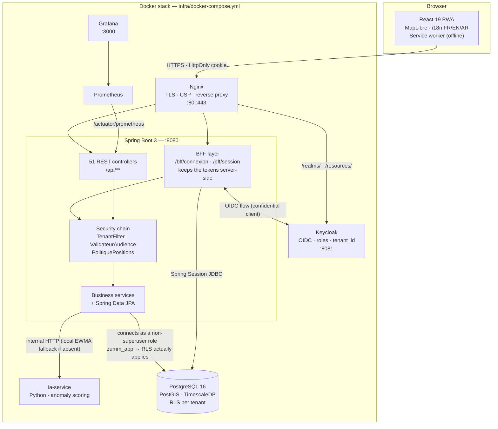

<p align="center">
  
</p>

<h1 align="center">Zümm</h1>

<p align="center"><em>Geographic information system for beekeeping management and monitoring</em></p>

<p align="center">
  <a href="https://github.com/iyednefzi99/Z-mm/actions/workflows/ci.yml"></a>
  <a href="https://github.com/iyednefzi99/Z-mm/actions/workflows/build-pdfs.yml"></a>
  
  
</p>

<p align="center">
  <a href="README.md">Français</a> · <strong>English</strong> · <a href="README.ar.md">العربية</a>
</p>

---

## 1. Overview

Zümm is a multi-tenant web application that manages a beekeeping operation end to
end: where the hives are, who visits them, what they produce, and when they start
failing.

A professional beekeeper today tracks apiaries across paper notebooks and
scattered spreadsheets: the exact location of a site is oral knowledge, visit
reports never make it back, and a declining colony is spotted too late. Zümm
replaces that setup with a single mapped repository, fed from the field and from
sensors, with alerts that warn before the loss.

The repository holds **the application** (Spring Boot backend, React PWA, AI
microservice, Docker infrastructure) **and the engineering deliverables** that
justify it: a trilingual requirements specification, a Scrum/DevOps roadmap, a
design system, and an architecture decision log.

## 2. Features

**Field work and livestock**

- Record farms, apiaries, hives and their composition (brood boxes, supers,
  frames), along with queen history and requeening events.
- Fill in a visit report with photos, then export it as a PDF. The inspection
  sheet is **structured** — brood, stores, queen cells, temperament — and keeps
  "not observed" distinct from "no".
- Plan rounds, assign field agents, and have a manager approve or reject a
  schedule. Planned visits export as iCalendar, and an agent can subscribe to
  their own calendar from a phone.
- Track an apiary's postal address and forage resources, its location history
  (migratory beekeeping), splits and swarm captures.
- Work **offline**: the PWA keeps what was entered and replays it when the
  network returns. An apiary is **taken along** explicitly before heading out —
  a snapshot **timestamped by the server**, expiring after fourteen days — and
  an entry rejected on replay goes to **quarantine** with the reason, instead of
  vanishing.
- Resume a visit draft from another device: its content stays opaque to the
  server and enters no record until it is submitted.
- Build your own inspection sheet from a **closed** catalogue of forty-four
  observation points — you switch on existing boxes, you do not invent new ones,
  otherwise nothing can be counted across farms any more.
- Dictate an observation: transcription happens **on the device**, and the
  interface refuses to start where the browser would send the audio to a
  third-party service.
- Open a hive's record by scanning its **QR** code or **NFC** tag, with a
  printable label sheet.

**Health record**

- Log treatments with their product, active substance, dose **and its unit**, and
  withdrawal period — the end of the withdrawal period is computed by the
  database, and the list of hives that cannot be harvested today reads off one
  screen.
- Log feedings, keeping 1:1 syrup distinct from 2:1: they do not serve the same
  purpose.
- Count varroa by sticky board or by sample. The rate is **not stored**: it does
  not carry the same unit depending on the method, and it is computed — with its
  unit and its verdict — where it can be explained.
- Name the diseases observed during a visit, with their severity, instead of
  leaving them in a free-text field.
- Make the veterinary prescription **verifiable**: its scan is attached to the
  treatment, and the treatment keeps its **own** copy of the withdrawal period —
  the leaflet is authoritative, not the catalogue.
- Assemble the paperwork for an organic audit while **naming what Zümm cannot
  verify**: the origin of sugars, of wax, and land tenure come out as "to be
  substantiated", never as "compliant".

**Breeding and genetics**

- Keep queen genealogy — a queen, her mother, her line — and read it as a tree.
- Track grafting series and the regulatory breeding register as a PDF.
- Compare stocks on five criteria, each in its own unit and with its own
  observation count. **No overall score**: adding up temperament and yield means
  nothing.

**Mapping**

- View apiaries on a map, search for sites near a point, detect apiary clusters
  and competing neighbourhoods.
- GPS coordinates are returned **filtered by role**: the exact position of an
  apiary is sensitive data (hive theft).

**Production and traceability**

- Record harvests — honey, but also pollen, propolis, royal jelly, wax, swarms
  and queens, each in its own unit —, build packaging batches, and trace a batch
  back to the hives it came from.
- Generate a batch's legal label text and a traceability QR code.
- Compare one season against the previous one over **calendar years**, where
  every other aggregate in the product slides over a rolling twelve months.
- Keep an equipment inventory and its maintenance plan, a stock with reorder
  thresholds, and accounts that give profitability **per hive**. Unallocated
  expenses stay whole and separate: an invented allocation key would give a
  prettier and less truthful figure.
- Export every record — fourteen resources, as CSV, TXT and XLSX — and produce
  the annual report as a PDF.

**Monitoring and alerts**

- Ingest sensor measurements (weight, temperature, humidity) as time series,
  with daily aggregation.
- Detect anomalies through a Python microservice, falling back to local EWMA
  detection when the service is absent.
- Health alerts, task reminders, and dashboards for summary, production and
  forecasts.
- **Theft alarm** built on the weight series already ingested: a drop is a
  harvest if a harvest was recorded that day, and a theft otherwise. Without that
  check, the first honey flow would set off the alarm across the whole apiary.
- Read a sensor **directly over Bluetooth** from the browser, on the standard SIG
  profile — no proprietary frame decoder guessed at.
- Weigh super by super, and share a telemetry feed outside the farm through a
  token bound to a single hive, carrying no position.
- A rule engine produces the tasks to do; colony health and swarming-risk indices
  are **computed on read**, never stored.

**Apiary environment**

- Load your own **land-cover** layer and read the areas by cover type within the
  foraging radius, their rotation year on year, and the distance to the nearest
  cultivated parcel. The data is **received, never queried**: asking a third-party
  service would mean sending it the apiary's position.
- Record **observed** bloom and set it against the declared calendar, with the
  gap in days — the declared one predicts, the observed one records.
- Cut the server's outbound traffic and the map tiles separately: **two**
  switches, because there are two kinds of traffic, and a single one would
  suggest a silent network where it is only half silent.

**Multi-tenant operation**

- Strict separation between farms, enforced **by the database** (PostgreSQL
  RLS), not by application code alone.
- Four business roles — `apiculteur`, `superviseur`, `responsable`, `admin` —
  plus a `capteur` role limited to measurement ingestion.
- Sign-up by invitation code, audit log, CSV export.
- **Trilingual** interface in French / English / Arabic, with full RTL for
  Arabic.

## 3. Tech stack

| Technology | Role in the project |
|---|---|
| **Spring Boot 3.5** (JDK 17) | REST API, business layer, security. Spring MVC + Spring Data JPA. |
| **PostgreSQL 16 + PostGIS + TimescaleDB** | Single instance. PostGIS carries the spatial queries (proximity, clusters, neighbours); TimescaleDB the sensor-measurement hypertable. |
| **Flyway** | 19 versioned migrations — the schema rebuilds identically from scratch. |
| **Keycloak** | OIDC identity provider. Issues the tokens, carries the roles and the `tenant_id` claim. |
| **Spring Session JDBC** | Server-side BFF sessions: the browser only ever receives an `HttpOnly` cookie, never a token. |
| **React 19 + TypeScript + Vite** | Client PWA. In-house router (ADR-005), no `react-router`. |
| **MapLibre GL** | Map rendering of apiaries, OpenStreetMap tiles. |
| **springdoc-openapi** | Generates the OpenAPI 3.1 contract from the code; `openapi-typescript` derives the front-end types from it — CI fails if the two diverge. |
| **Python 3.12, standard library** (`ia-service`) | Anomaly scoring offloaded from the measurement series. `requirements.txt` is deliberately empty: no external dependency to track while the engine stays statistical. |
| **Nginx** | Reverse proxy, TLS termination, security headers and CSP. |
| **Prometheus + Grafana** | Micrometer metrics exposed through Actuator, operational dashboards. |
| **Testcontainers** | Integration tests against a **real** PostgreSQL/PostGIS, not an in-memory database. |
| **JaCoCo** | Merged unit + integration coverage, blocking floors at 80% (instructions) and 60% (branches). |

## 4. Architecture



**The path of a request, in one sentence:** the browser holds nothing but a
session cookie; Nginx forwards to the BFF, which attaches the session to the
token it keeps server-side; `ValidateurAudience` checks the issuer *and* the
audience, `TenantFilter` requires the `tenant_id` claim (403 otherwise) and
pushes it into the PostgreSQL session; RLS then filters the rows **inside the
database**, under a non-superuser role that cannot bypass it.

## 5. Project structure

```
Zümm/
├── backend/                  Spring Boot API (Maven, wrapper included)
│   └── src/main/
│       ├── java/…/controller/    51 REST controllers + 2 BFF controllers
│       ├── java/…/domain/        44 JPA entities + enums
│       ├── java/…/service/       business services
│       ├── java/…/tenant/        TenantFilter, multi-tenant context and resolver
│       ├── java/…/securite/      PolitiquePositions, agent scoping
│       ├── java/…/config/        SecurityConfig, ValidateurAudience, OpenAPI
│       ├── java/…/web/           DTOs, pagination, idempotency, error handling
│       └── resources/db/migration/  31 Flyway migrations (V1 → V31)
├── frontend/                 React 19 + TypeScript PWA (Vite)
│   └── src/
│       ├── vues/                 42 screens: 23 console, 10 public pages, sign-in, account, errors
│       ├── ui/                   cross-cutting components (modal, toasts, SVG charts)
│       ├── api/                  openapi.json + generated types + parity guard
│       ├── auth/  routage/       BFF session and in-house router (ADR-005)
│       ├── offline/              offline replay queue and quarantine
│       ├── terrain/  carnet/     offline take-along, configurable inspection sheet
│       ├── elevage/              queen lineage tree (SVG)
│       ├── environnement/        cover areas and observed bloom
│       ├── capteurs/  voix/      SIG Bluetooth reading, on-device dictation
│       ├── local/                embedded EWMA, exact mirror of the backend service
│       └── i18n/locales/         FR / EN / AR resources
├── ia-service/               Python anomaly-detection microservice
├── infra/                    docker-compose, Nginx, Keycloak, Prometheus, Grafana
├── config/                   ConfigZumm.example.ini — business parameters
├── scripts/                  demarrer.ps1, check-sync.sh, check-pdf-current.sh
├── docs/                     dev guide, security, SOLID, product strategy, mockups
├── cahier de charge/{fr,en,ar}/   trilingual requirements spec (LaTeX → 3 PDFs)
├── roadmap/                  Scrum/DevOps roadmap + operational sources and ADRs
├── design/                   design system FR/EN/AR + DTCG tokens
└── assets/logo/              logos (master SVGs, PNG, favicons, print PDF)
```

## 6. Installation and setup

### Prerequisites

| Tool | Version | Check |
|---|---|---|
| JDK | 17 or above | `java -version` |
| Docker Engine / Desktop | daemon running | `docker info` |
| Node.js | 20 or above | `node -v` |

Maven is not required: the repository ships `backend/mvnw`.

### Clone and configure

```bash
git clone https://github.com/iyednefzi99/Z-mm.git
cd Z-mm
cp .env.example .env
```

The `.env` file lives **at the root**, not in `infra/`. Every password is
declared mandatory: the stack refuses to start without them rather than falling
back on a guessable value.

| Variable | Required | Default | Purpose |
|---|---|---|---|
| `DB_PASSWORD` | yes | — | Owner role `zumm`: Flyway migrations (DDL) and the Keycloak database. |
| `DB_APP_USER` | yes | `zumm_app` | Non-superuser application role, created by migration V3. |
| `DB_APP_PASSWORD` | yes | — | Password of the application role. The application connects through it so that RLS actually applies. |
| `KC_ADMIN_USER` | yes | `admin` | Keycloak administration console. |
| `KC_ADMIN_PASSWORD` | yes | — | Keycloak administrator password. |
| `GRAFANA_PASSWORD` | yes | — | Grafana interface. |
| `SPRING_PROFILES_ACTIVE` | no | `dev` | Spring profile: `dev` or `prod`. |
| `ZUMM_BFF_CLIENT` | no | `zumm-bff` | Confidential Keycloak client used by the BFF. |
| `ZUMM_BFF_SECRET` | no | `secret-bff-dev` | BFF client secret. **Regenerate in production** (`openssl rand -base64 32`) and match it in the realm. |
| `ZUMM_OIDC_ISSUER_URI` | no | internal Keycloak URL | In production, Keycloak's **public** URL — the one carried by tokens issued for the browser. |
| `ZUMM_IA_URL` | no | `http://ia-service:8000` | Anomaly microservice. **Emptying** the variable disables the coupling: fall back to local EWMA detection, without error. |
| `POSTGRES_IMAGE` | no | local PostGIS+TimescaleDB image | Production target: `timescale/timescaledb-ha:pg16-ts2.14`. |

### Run the full stack

Two prerequisites are **not** versioned and must be produced once, otherwise
`postgres` and `nginx` refuse to start: the local PostgreSQL image (the default
for `POSTGRES_IMAGE`) and the development TLS certificate.

```bash
docker build -f infra/test-postgres.Dockerfile -t zumm/test-postgres:16 infra/
bash infra/generer-certificat-dev.sh
docker compose --env-file .env -f infra/docker-compose.yml up -d --build
```

On Windows, `Demarrer-Zumm.cmd` (double-click) does the same through
`scripts/demarrer.ps1`: it wakes Docker Desktop, brings the containers up, waits
for `/actuator/health` to answer `UP`, then opens the browser.

| Service | Address |
|---|---|
| Application (through Nginx) | `https://localhost` |
| Keycloak | `http://localhost:8081` |
| Grafana | `http://localhost:3000` |

### Develop without the stack

```bash
# Backend alone — API on http://localhost:8080
cd backend && ./mvnw spring-boot:run

# Frontend alone — http://localhost:5173, proxies /api and /actuator to :8080
cd frontend && npm install && npm run dev
```

### Database

No manual step: **Flyway applies the 31 migrations at startup**, creating the
application role, the RLS policies, the PostGIS extension and the TimescaleDB
hypertable. To start over:

```bash
docker compose --env-file .env -f infra/docker-compose.yml down -v
```

## 7. Usage

1. **Sign in** at `https://localhost`. The entry screen posts the credentials to
   the BFF — they never travel through the URL, and no token reaches the
   browser.
2. **Sign up**, where applicable, with a **farm code**: that is what attaches the
   new account to its farm. Without a valid code, sign-up is refused — you do
   not join a tenant by accident.
3. **Declare the livestock**, in this order: farm → site (apiary) → hives →
   composition. The site's position feeds the map directly.
4. **Run a visit**: open a hive, fill in the report, attach photos, export the
   PDF (`GET /api/visites/{id}/rapport.pdf`).
5. **Plan a round**: a manager assigns the agents, the schedule goes out for
   approval, and the agent finds it on their phone — including off-network.
6. **Track production**: record the harvests, build the batches, obtain the
   traceability (`/api/recoltes/tracabilite/{lot}`) and the legal label text.
7. **Monitor**: the dashboards (summary, production, forecasts, health alerts)
   and the measurement anomalies surface whatever is slipping.

What you see depends on your role: an `apiculteur` reads the repository and
enters visits, measurements and harvests; a `superviseur` adds schedule
approval; a `responsable` creates and deletes apiaries, hives, agents and farms,
and consults the audit log and the invitation codes; an `admin` has the same
scope at the top. A valid token **without a business role** reaches no endpoint.

## 8. Product preview

No online demo: the stack is meant to run locally (section 6).

<!-- TODO — screenshots to be taken, then uncomment the table below.
     Format: 1440×900, light theme, on the demo dataset
     (tenant `exploitation-demo`), no real data:
       docs/screenshots/tableau-de-bord.png  summary, production, alerts
       docs/screenshots/carte.png            apiaries and hives on MapLibre
       docs/screenshots/visite.png           filling in a visit report
       docs/screenshots/hors-ligne.png       offline banner + replay queue
       docs/screenshots/rtl-ar.png           Arabic interface, full RTL

     Table to restore as-is, and to mirror in README.md:

     | Dashboard | Apiary map |
     |:-:|:-:|
     |  |  |
-->

In the meantime, the static HTML design mockups can be browsed without starting
anything: [`docs/maquettes/`](docs/maquettes/) — agent calendar, visit report,
apiary map.

## 9. API documentation

The API exposes **140 paths / 202 operations** under OpenAPI 3.1. The contract is
**generated from the code** and versioned in
[`frontend/src/api/openapi.json`](frontend/src/api/openapi.json); CI fails if the
code and the contract diverge.

- Interactive UI: `http://localhost:8080/swagger-ui.html`
- Raw contract: `http://localhost:8080/v3/api-docs`

Both addresses assume the **backend is reached directly** (`./mvnw
spring-boot:run`). Under the full Docker stack, port 8080 is not published and
Nginx only forwards `/api/`, `/bff/`, `/actuator/`, `/oauth2/`, `/login/` and the
Keycloak routes: Swagger UI is not exposed there — it is development tooling,
not a production surface.

**Authentication.** Every `/api/**` route requires an authenticated session
(`HttpOnly` cookie) and **at least one business role**. The underlying token must
carry a `tenant_id` claim, failing which the filter answers `403`. The `/bff/**`
routes are the public identity entry point.

**Two exceptions, and no more.** `GET /api/calendrier/{jeton}.ics` (subscribing
to one's own calendar) and `GET /api/flux/{jeton}` (sharing a telemetry feed)
answer without a session. Both carry a 256-bit token stored only as a
**SHA-256 digest**, expire, can be revoked, show their last use, and return **no
position**. Neither has rate limiting: to be addressed before any wide opening.

### Identity routes

| Method | Path | Auth | Body / Parameters | Response |
|---|---|---|---|---|
| `POST` | `/bff/connexion` | none | `{ identifiant, motDePasse }` | `204` + session cookie. `401` on invalid credentials — without revealing whether the account exists; `403` if the account is suspended; `503` if the IdP is unreachable |
| `POST` | `/bff/inscription` | none | `{ nom, courriel, motDePasse, code }` | `201`. `422` if the farm code is unknown or the password is rejected; `409` if the email is already taken |
| `GET` | `/bff/session` | cookie | — | Current identity, roles and tenant; `401` outside a session |

### Representative examples

| Method | Path | Required roles | Parameters | Response |
|---|---|---|---|---|
| `GET` | `/api/info` | **none** (public) | `Accept-Language` header | Application identity, translated |
| `GET` | `/api/ruches` | any business role | pagination | Hives of the current tenant |
| `POST` | `/api/ruches` | `responsable`, `admin` | Hive | `201` + created hive |
| `POST` | `/api/visites` | any business role | Visit report | `201` + created visit |
| `GET` | `/api/visites/{id}/rapport.pdf` | any business role | — | PDF of the report |
| `GET` | `/api/sites/proches` | any business role | `lat`, `lon`, `rayon` | Sites within the radius, **coordinates filtered by role** |
| `GET` | `/api/sites/grappes` | any business role | — | Apiary clusters (PostGIS aggregation) |
| `POST` | `/api/mesures` | `capteur` **or** any business role | Sensor measurement | `201`, idempotent write into the hypertable |
| `GET` | `/api/mesures/journalier` | any business role | date range, hive | Series aggregated by day |
| `GET` | `/api/anomalies` | any business role | — | Detected anomalies (AI microservice or EWMA fallback) |
| `POST` | `/api/plannings/{id}/approuver` | `superviseur`, `responsable`, `admin` | — | Schedule approved |
| `GET` | `/api/recoltes/tracabilite/{lot}` | any business role | — | Traceability chain of the batch |
| `GET` | `/api/tableaux/synthese` | any business role | — | Dashboard indicators |
| `GET` | `/api/audit` | `responsable`, `admin` | filters | Audit log |
| `POST` | `/api/invitations` | `responsable`, `admin` | — | Farm invitation code |
| `GET` | `/api/export/visites` | any business role | filters | CSV export |
| `POST` | `/api/traitements/lot` | any business role | hives + treatment | **One transaction per hive**: refusals are named with their reason, the other writes hold |
| `GET` | `/api/ruchers/{id}/emport` | any business role | — | Offline snapshot of an apiary, **timestamped by the server**, expiring after 14 days |
| `GET` | `/api/reines/{id}/lignee` | any business role | — | A queen's ancestry and descent |
| `GET` | `/api/environnement/sites/{id}/couvert` | any business role | `millesime` | Areas by cover class within the foraging radius, with the share of the circle actually described |
| `GET` | `/api/environnement/sites/{id}/rotation` | any business role | — | The same areas, year by year |
| `GET` | `/api/briefing` | any business role | — | The day's briefing, **with no language model**: four records read, each line citing what it rests on |
| `GET` | `/api/calendrier/{jeton}.ics` | **none** (token) | — | One agent's calendar, no position |
| `GET` | `/api/flux/{jeton}` | **none** (token) | — | Telemetry feed for **one** hive, no position |

`POST`, `PUT` and `DELETE` on `fermiers`, `fermes`, `sites`, `agents` and
`ruches` are restricted to `responsable` and `admin` — reading stays open to any
business role. The `capteur` role opens **only** `POST /api/mesures`: it grants
access to no other endpoint.

Full CRUD resources (`GET`/`POST` on the collection, `GET`/`PUT`/`DELETE` on the
item): `agents`, `fermes`, `fermiers`, `lots`, `plannings`, `ruches`, `sites`,
`taches`, `visites`.

## 10. Engineering decisions

Every structuring decision is recorded in an ADR
([`roadmap/operationnel/06_decisions/`](roadmap/operationnel/06_decisions/)).
The most consequential ones:

**Multi-tenancy in the database rather than in the code** ([ADR-001](roadmap/operationnel/06_decisions/ADR-001-multi-tenant.md)).
Separation goes through PostgreSQL Row Level Security, and the application
connects under a **non-superuser** role — a superuser would bypass RLS. Cost:
every business table must carry `tenant_id`, its RLS policy and a **composite**
foreign key `(id, tenant_id)`. Benefit: a forgotten `WHERE` in a query does not
leak another farm's data.

**No token in the browser** ([ADR-006](roadmap/operationnel/06_decisions/ADR-006-stockage-des-jetons.md), [ADR-009](roadmap/operationnel/06_decisions/ADR-009-connexion-dans-l-application.md)).
The backend runs the OIDC flow itself and keeps the tokens server-side (Spring
Session JDBC); the browser only receives an `HttpOnly` cookie. We trade server
statelessness for immunity to token theft via XSS. The CSP in
`infra/nginx/nginx.conf` remains the second line of defence — `unsafe-inline` on
`script-src` would be a regression, never a fix.

**RLS rather than TimescaleDB compression** ([ADR-008](roadmap/operationnel/06_decisions/ADR-008-rls-contre-compression.md)).
PostgreSQL forbids compression on a table under RLS: a choice had to be made.
Isolation wins over storage savings; measurements stay uncompressed, which holds
at the target volume ([ADR-002](roadmap/operationnel/06_decisions/ADR-002-volumetrie.md)).

**In-house SVG charts rather than Chart.js** ([ADR-007](roadmap/operationnel/06_decisions/ADR-007-graphiques-svg.md)).
The specification called for Chart.js. A charting library imposes its theme, its
weight and its canvas rendering — hence nothing for a screen reader to read. The
charts are drawn in SVG, in the design system's colors, accessible. Cost: code to
write and to test.

**In-house router rather than `react-router`** ([ADR-005](roadmap/operationnel/06_decisions/ADR-005-routage-front.md)).
The application has about a dozen views and needs neither nested routes nor
complex lazy loading. One fewer dependency to track.

**The OpenAPI contract is authoritative, and CI proves it.** The contract is
regenerated on every `verify`; if it differs from the committed version, the
build breaks. The front-end TypeScript types are derived from it, and a parity
guard (`frontend/src/api/parite.ts`) checks **at compile time** that the
hand-written types describe the same thing. A front end describing a vanished API
becomes a build error, not a runtime bug.

**Integration tests against a real database.** Testcontainers starts a genuine
PostgreSQL/PostGIS/TimescaleDB: RLS, spatial indexes and hypertables cannot be
simulated in an in-memory database. Cost: Docker required, plus a home-made test
image — the `timescale/timescaledb-ha` registry proved impractical from some
networks, so the test image starts from `postgis/postgis` + TimescaleDB via APT.
**The runtime target remains `timescale/timescaledb-ha`**; only the test database
differs.

**jOOQ dropped.** The specification called for it; it was never needed.
Analytical queries go through JPQL and native SQL.

**Offline means taking data along, not caching it** ([ADR-012](roadmap/operationnel/06_decisions/ADR-012-hors-ligne-selectif.md)).
The service worker caches **no** API response. An apiary is taken along on
request — bounded, timestamped by the server, and perishable; measurements,
weather and exact positions stay out. Adding `/api` to `runtimeCaching` would be
a step backwards, not a shortcut.

**AI runs on the device, or not at all** ([ADR-013](roadmap/operationnel/06_decisions/ADR-013-ou-tourne-l-ia.md)).
Dictation only starts if the browser declares it transcribes locally. The daily
briefing goes through **no** language model: it reads four records and cites what
each line rests on. A generated sentence would read better and verify worse — and
it would mean sending the farm's history outside.

**We do not buy hardware** ([ADR-014](roadmap/operationnel/06_decisions/ADR-014-capteurs-du-commerce.md)).
Bluetooth is limited to the standard SIG profile, whose identifiers and units are
public. Writing a decoder for a manufacturer's proprietary frame that nobody here
owns a device for would mean guessing at a data structure: the appearance of
support without its reliability.

**Environmental data is received, never queried** ([ADR-015](roadmap/operationnel/06_decisions/ADR-015-occupation-du-sol.md)).
Querying a land-cover service directly would mean sending it the apiary's
position — what `PolitiquePositions` masks and what local mode cuts for map
tiles. The farm loads its own layer; the ingester translates it into a **closed**
taxonomy of ten classes, and an unknown class fails the **whole** load rather
than producing wrong areas that would still add up to 100%.

**Refusing what cannot be verified.** Three expected features were turned down
with their reasons written out: in-hive acoustic analysis, pollen counts, and a
proprietary frame adapter. Each would produce a number the beekeeper cannot check
other than by opening the hive. The same reasoning rules out an overall genetic
score and a health × flora correlation computed over ten apiaries.

SOLID mapping and identified debt:
[`docs/ARCHITECTURE-SOLID.md`](docs/ARCHITECTURE-SOLID.md).
Security invariants not to undo: [`docs/SECURITE.md`](docs/SECURITE.md).

## 11. Testing

Figures read from the suites' own output on 2026-09-05, not copied over:

| Suite | Volume | Tooling |
|---|---|---|
| Backend — unit | **159** tests across 29 classes, 0 failures, 0 skipped | JUnit 5, Mockito |
| Backend — integration | **242** tests across 34 classes, 0 failures, **0 skipped** | Testcontainers on a real PostgreSQL/PostGIS/TimescaleDB |
| Backend — coverage | **82.1%** instructions, 83.9% lines, **63.0%** branches | JaCoCo, merged campaigns, **blocking** floors at 80% (instructions) and 60% (branches) |
| Frontend | **413** tests, 52 files | Vitest, Testing Library, jsdom |

What is covered: the security chain (missing tenant, invalid audience, token
without a role), RLS isolation between farms, PostGIS spatial queries, idempotent
measurement ingestion, PDF generation, OpenAPI contract conformance, and on the
front end the business views, the dialogs, the charts and the sign-in journey.

**Two tests written for one feature found another one broken.** Five foreign
keys added between migrations `V20` and `V27` used `ON DELETE SET NULL` without
naming their column: PostgreSQL also nulled `tenant_id`, so deleting a hive that
carried an expense failed with a `500`. And `GET /api/mesures/alertes` could only
succeed **on an empty list** ever since SPRINT-06 — the read lived outside a
transaction and the association was `LAZY`. No test had ever called it with an
open alert. A route covered by a test that never puts it in the interesting state
is an uncovered route.

```bash
# Backend — unit only (Docker not required)
cd backend && ./mvnw test

# Test PostgreSQL image — build once, before the first verify
docker build -f infra/test-postgres.Dockerfile -t zumm/test-postgres:16 infra/

# Backend — unit + integration + coverage (Docker required)
cd backend && ./mvnw -B verify
# Report: backend/target/site/jacoco/index.html

# Frontend — the four steps CI runs, in order
cd frontend && npm ci
npm run typecheck && npm run lint && npm test && npm run build
npm run test:couverture
```

> ⚠️ **A `BUILD SUCCESS` proves nothing if the integration tests were skipped
> for lack of Docker.** Check the `Tests run: N, … Skipped: 0` line on the `…IT`
> reports. CI checks this explicitly and fails otherwise.

Testcontainers ≥ 1.21 is required from Docker Engine 29 onwards: earlier versions
fail with `HTTP 400` on daemon discovery and **silently skip** the whole
integration campaign, green build included. The `pom.xml` therefore pins the
version.

## 12. Known limitations and next steps

**What does not work perfectly yet**

- **Branch coverage at 63.0%**, against 82.1% for instructions: error paths
  remain less covered than nominal ones. The blocking floor sits at 60% — an
  anti-regression ratchet, not a target.
- **Uncompressed measurements**: an accepted consequence of ADR-008. At a much
  larger volume, another trade-off will be needed (partitioning, cold archival).
- **`Ping`** survives as the end-to-end probe from SPRINT-00. That is a decision
  documented in its javadoc, not an oversight.
- **Anomaly detection**: the AI microservice remains a statistical score.
  local EWMA fallback is cruder still, and it is now **implemented twice** —
  in Java on the server and in TypeScript in the browser, for on-device
  detection. Both are pinned by tests fixing the same numbers on the same series:
  touching one without the other breaks a campaign.
- **No rate limiting** on the two public token routes. They are bounded,
  expirable and carry no position, but nothing throttles repeated calls — to be
  handled before any wide opening.
- **Local mode cuts one kind of traffic at a time**: the server setting can do
  nothing about a map tile requested by the browser, and vice versa. Both
  switches exist, and the interface says so rather than promising a silence it
  could not deliver.
- **The land-cover reference is not shipped**: the farm loads its own layer.
  That is the accepted cost of never reaching outside on its own.
- **No public deployment**: the stack is designed for a single Docker host.
  Running it in production assumes a real certificate, a regenerated BFF secret,
  and `ZUMM_OIDC_ISSUER_URI` set to Keycloak's public URL.
- **No `LICENSE` file**: academic project, no usage rights granted by default.

**What would come next**

- Raise the branch floor as error paths get covered — 60% freezes what exists,
  it aims at nothing.
- Push notifications on health alerts instead of active checking.
- An anomaly model trained on the flock's real history, instead of a statistical
  threshold.
- Finer conflict resolution on the offline replay queue.
- Automated rotation of the BFF secret and the stack's passwords.

Prioritised backlog and positioning: [`docs/STRATEGIE-PRODUIT.md`](docs/STRATEGIE-PRODUIT.md).

## Documentary deliverables

The compiled PDFs are versioned: no need to install LaTeX to read the dossier.

```bash
cd "cahier de charge/fr" && latexmk -pdf cahier_des_charges_fr.tex           # pdflatex
cd "cahier de charge/en" && latexmk -pdf cahier_des_charges_en.tex           # pdflatex
cd "cahier de charge/ar" && latexmk -pdf -xelatex cahier_des_charges_ar.tex  # XeLaTeX, RTL
```

Trilingual consistency is a hard constraint: any structural change on the FR side
must be mirrored in EN and AR. `bash scripts/check-sync.sh` verifies it, CI
replays it, and `scripts/check-pdf-current.sh` fails if a committed PDF no longer
matches its sources. See [`CONTRIBUTING.md`](CONTRIBUTING.md).

## Licence and academic constraint

Academic project — **all rights reserved**. No `LICENSE` file accompanies the
repository: no licence to use, modify or redistribute is granted.

The use of code generators to produce the deliverable is prohibited by the
examination. The documentation and design of this repository are done by hand.
