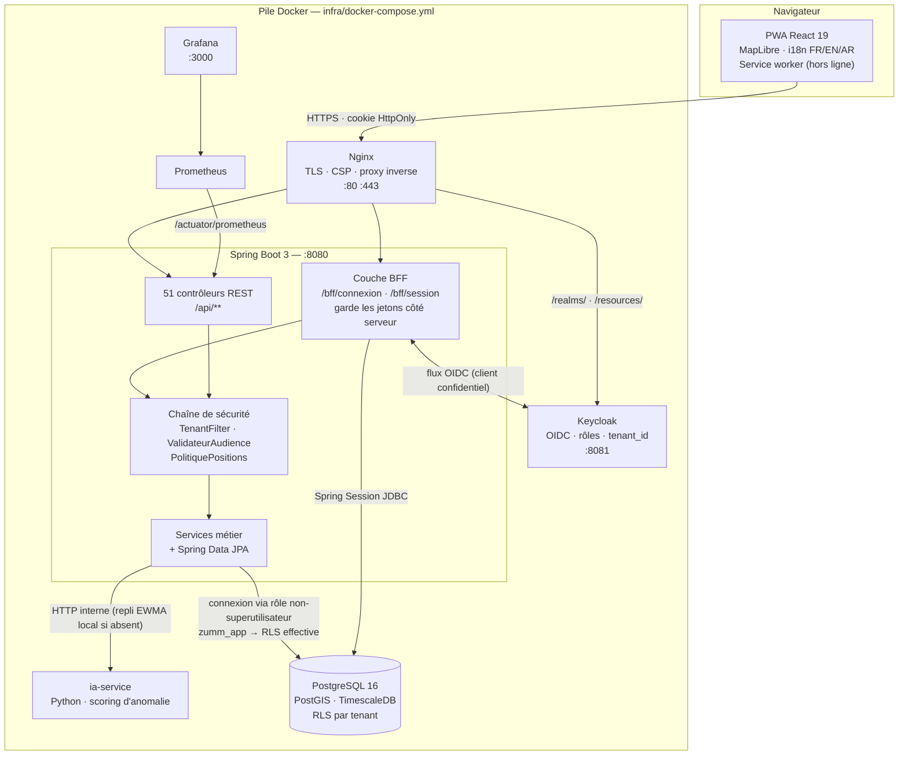

<p align="center">
  
</p>

<h1 align="center">Zümm</h1>

<p align="center"><em>Système d'information géographique de gestion et de suivi apicole</em></p>

<p align="center">
  <a href="https://github.com/iyednefzi99/Z-mm/actions/workflows/ci.yml"></a>
  <a href="https://github.com/iyednefzi99/Z-mm/actions/workflows/build-pdfs.yml"></a>
  
  
</p>

<p align="center">
  <strong>Français</strong> · <a href="README.en.md">English</a> · <a href="README.ar.md">العربية</a>
</p>

---

## 1. Présentation

Zümm est une application web multi-exploitations qui pilote un cheptel apicole de
bout en bout : où sont les ruches, qui les visite, ce qu'elles produisent et
quand elles vont mal.

Un apiculteur professionnel suit aujourd'hui ses ruchers sur des carnets papier
et des tableurs dispersés : la position exacte des sites est un savoir oral, les
rapports de visite ne remontent jamais, et une colonie qui décroche est repérée
trop tard. Zümm remplace ce dispositif par un référentiel unique, cartographié,
alimenté par le terrain et par les capteurs, avec des alertes qui préviennent
avant la perte.

Le dépôt réunit **l'application** (backend Spring Boot, PWA React, microservice
IA, infrastructure Docker) **et les livrables d'ingénierie** qui la justifient :
cahier des charges trilingue, roadmap Scrum/DevOps, charte de design, registre de
décisions d'architecture.

## 2. Fonctionnalités

**Terrain et cheptel**

- Recenser les exploitations, les ruchers, les ruches et leur composition
  (corps, hausses, cadres), avec l'historique des reines et des remérages.
- Saisir un rapport de visite avec photos, puis l'exporter en PDF. La grille
  d'inspection est **structurée** — couvain, réserves, cellules royales,
  tempérament — et distingue « non observé » de « non ».
- Planifier les tournées, affecter les agents, faire approuver ou refuser un
  planning par un responsable. Les visites planifiées s'exportent en iCalendar,
  et un agent peut s'abonner à son propre agenda depuis son téléphone.
- Suivre l'adresse et les ressources florales d'un rucher, son historique
  d'emplacement (transhumance), les divisions et les captures d'essaim.
- Travailler **hors connexion** : la PWA garde la saisie et la rejoue au retour
  du réseau. Un rucher s'**emporte** explicitement avant de monter — instantané
  daté par le serveur, périmé à quatorze jours — et une saisie refusée au rejeu
  passe en **quarantaine** avec le motif, au lieu de disparaître.
- Reprendre un brouillon de visite d'un appareil à l'autre : son contenu reste
  opaque au serveur et n'entre dans aucun registre tant qu'il n'est pas validé.
- Composer sa propre grille d'inspection sur un référentiel **fermé** de
  quarante-quatre points d'observation — on active des cases existantes, on
  n'en invente pas, sans quoi plus rien ne se compte d'une exploitation à
  l'autre.
- Dicter une observation : la transcription se fait **sur l'appareil**, et
  l'interface refuse de démarrer là où le navigateur enverrait la voix à un
  service tiers.
- Ouvrir la fiche d'une ruche en scannant son **QR** ou sa puce **NFC**, avec
  une planche d'étiquettes imprimable.

**Registre sanitaire**

- Consigner les traitements avec leur produit, leur substance active, leur dose
  **et son unité**, et leur délai de carence — la fin de carence est calculée par
  la base, et la liste des ruches qu'on ne peut pas récolter aujourd'hui se lit
  d'un écran.
- Consigner les nourrissements, en distinguant le sirop 1:1 du 2:1 : ils ne
  servent pas à la même chose.
- Compter le varroa par lange ou par échantillon. Le taux **n'est pas stocké** :
  il n'a pas la même unité selon la méthode, et il est calculé — avec son unité
  et son verdict — là où on peut l'expliquer.
- Nommer les pathologies constatées lors d'une visite, avec leur gravité, plutôt
  que de les laisser dans un champ de texte libre.
- Rendre l'ordonnance vétérinaire **vérifiable** : son scan est attaché au
  traitement, et le traitement garde sa propre copie du délai de carence — la
  notice fait foi, pas le référentiel.
- Rassembler les pièces d'un contrôle bio, en **nommant ce que Zümm ne peut pas
  vérifier** : l'origine des sucres, celle de la cire et le statut du foncier
  sortent « à justifier », jamais « conforme ».

**Élevage et génétique**

- Tenir la généalogie des reines — une reine, sa mère, sa lignée — et la lire
  comme un arbre.
- Suivre les séries de greffage et le registre d'élevage réglementaire en PDF.
- Comparer les souches sur cinq critères, chacun dans son unité et avec son
  nombre d'observations. **Aucune note globale** : additionner une douceur et un
  rendement ne veut rien dire.

**Cartographie**

- Visualiser les ruchers sur une carte, chercher les sites proches d'un point,
  détecter les grappes de ruchers et les voisinages qui se concurrencent.
- Les coordonnées GPS sortent **filtrées selon le rôle** : la position exacte
  d'un rucher est une donnée sensible (vol de ruches).

**Production et traçabilité**

- Enregistrer les récoltes — miel, mais aussi pollen, propolis, gelée, cire,
  essaims et reines, chacun dans son unité —, constituer des lots de
  conditionnement, remonter la traçabilité d'un lot jusqu'aux ruches d'origine.
- Générer la mention légale d'un lot et un QR code de traçabilité.
- Comparer une saison à la précédente sur des **années civiles**, là où tous les
  autres agrégats glissent sur douze mois.
- Tenir l'inventaire du matériel et son plan de maintenance, un stock à seuils,
  et une comptabilité qui donne la rentabilité **par ruche**. Les dépenses non
  affectées restent entières et à part : une clé de répartition inventée
  donnerait un chiffre plus joli et moins vrai.
- Exporter l'intégralité des registres — quatorze ressources, en CSV, TXT et
  XLSX — et sortir le bilan annuel en PDF.

**Supervision et alertes**

- Ingérer les mesures de capteurs (poids, température, humidité) en série
  temporelle, avec agrégation journalière.
- Détecter les anomalies via un microservice Python, avec repli sur une
  détection EWMA locale si le service est absent.
- Alertes sanitaires, rappels de tâches, tableau de bord de synthèse, de
  production et de prévisions.
- **Alarme anti-vol** sur la série de poids déjà ingérée : une chute est une
  récolte si une récolte est enregistrée ce jour-là, un vol sinon. Sans cette
  vérification, la première miellée réveillerait l'alarme sur tout le rucher.
- Lire un capteur **directement en Bluetooth** depuis le navigateur, sur le
  profil normalisé SIG — aucun décodeur propriétaire deviné.
- Peser hausse par hausse, et partager un flux de télémétrie hors de
  l'exploitation par un jeton borné à une ruche, sans aucune position.
- Un moteur de règles engendre les tâches à faire ; les indices de santé et de
  risque d'essaimage sont **calculés à la lecture**, jamais stockés.

**Environnement du rucher**

- Verser sa propre couche d'**occupation du sol** et lire les surfaces par type
  de couvert dans le rayon de butinage, leur rotation d'une année à l'autre, et
  la distance à la parcelle cultivée la plus proche. La donnée est **accueillie,
  jamais interrogée** : interroger un service tiers reviendrait à lui envoyer la
  position du rucher.
- Noter la floraison **observée** et la confronter au calendrier déclaré, avec
  l'écart en jours — le déclaratif prévoit, l'observé constate.
- Couper le trafic sortant du serveur et celui des tuiles de carte : **deux**
  bascules, parce qu'il y a deux trafics et qu'un seul interrupteur ferait
  croire à un réseau muet là où il ne l'est qu'à moitié.

**Exploitation multi-clients**

- Cloisonnement strict entre exploitations, appliqué **par la base** (RLS
  PostgreSQL), pas seulement par le code applicatif.
- Quatre rôles métier — `apiculteur`, `superviseur`, `responsable`, `admin` —
  plus un rôle `capteur` limité à l'ingestion de mesures.
- Inscription par code d'invitation, journal d'audit, export CSV.
- Interface **trilingue** français / anglais / arabe, l'arabe en RTL complet.

## 3. Stack technique

| Technologie | Rôle dans le projet |
|---|---|
| **Spring Boot 3.5** (JDK 17) | API REST, couche métier, sécurité. Spring MVC + Spring Data JPA. |
| **PostgreSQL 16 + PostGIS + TimescaleDB** | Instance unique. PostGIS porte les requêtes spatiales (proximité, grappes, voisins) ; TimescaleDB l'hypertable des mesures capteurs. |
| **Flyway** | 31 migrations versionnées — le schéma se reconstruit à l'identique depuis zéro. |
| **Keycloak** | Fournisseur d'identité OIDC. Émet les jetons, porte les rôles et le claim `tenant_id`. |
| **Spring Session JDBC** | Sessions serveur du BFF : le navigateur ne reçoit qu'un cookie `HttpOnly`, jamais un jeton. |
| **React 19 + TypeScript + Vite** | PWA cliente. Routeur maison (ADR-005), pas de `react-router`. |
| **MapLibre GL** | Rendu cartographique des ruchers, fonds OpenStreetMap. |
| **springdoc-openapi** | Génère le contrat OpenAPI 3.1 depuis le code ; `openapi-typescript` en dérive les types du front — la CI échoue si les deux divergent. |
| **Python 3.12, bibliothèque standard** (`ia-service`) | Scoring d'anomalie déporté sur les séries de mesures. `requirements.txt` est volontairement vide : aucune dépendance externe à suivre tant que le moteur reste statistique. |
| **Nginx** | Proxy inverse, terminaison TLS, en-têtes de sécurité et CSP. |
| **Prometheus + Grafana** | Métriques Micrometer exposées par Actuator, tableaux de bord d'exploitation. |
| **Testcontainers** | Tests d'intégration sur un PostgreSQL/PostGIS **réel**, pas sur une base en mémoire. |
| **JaCoCo** | Couverture fusionnée unitaire + intégration, planchers bloquants à 92 % (instructions) et 80 % (branches). |

## 4. Architecture



**Le chemin d'une requête, en une phrase :** le navigateur n'a qu'un cookie de
session ; Nginx relaie vers le BFF, qui rattache la session au jeton qu'il garde
côté serveur ; `ValidateurAudience` vérifie l'émetteur *et* l'audience,
`TenantFilter` exige le claim `tenant_id` (403 sinon) et le pousse dans la
session PostgreSQL ; la RLS filtre alors les lignes **dans la base**, sous un
rôle non-superutilisateur qui ne peut pas la contourner.

## 5. Structure du projet

```
Zümm/
├── backend/                  API Spring Boot (Maven, wrapper embarqué)
│   └── src/main/
│       ├── java/…/controller/    51 contrôleurs REST + 2 contrôleurs BFF
│       ├── java/…/domain/        44 entités JPA + énumérations
│       ├── java/…/service/       services métier
│       ├── java/…/tenant/        TenantFilter, contexte et résolveur multi-tenant
│       ├── java/…/securite/      PolitiquePositions, portée des agents
│       ├── java/…/config/        SecurityConfig, ValidateurAudience, OpenAPI
│       ├── java/…/web/           DTO, pagination, idempotence, gestion d'erreurs
│       └── resources/db/migration/  31 migrations Flyway (V1 → V31)
├── frontend/                 PWA React 19 + TypeScript (Vite)
│   └── src/
│       ├── vues/                 42 écrans : 23 de console, 10 pages publiques, connexion, compte, erreurs
│       ├── ui/                   composants transverses (modale, toasts, graphiques SVG)
│       ├── api/                  openapi.json + types générés + garde de parité
│       ├── auth/  routage/       session BFF et routeur maison (ADR-005)
│       ├── offline/              file de rejeu hors connexion et quarantaine
│       ├── terrain/  carnet/     emport hors ligne, grille d'inspection paramétrable
│       ├── elevage/              arbre de lignées des reines (SVG)
│       ├── environnement/        surfaces de couvert et floraisons observées
│       ├── capteurs/  voix/      lecture Bluetooth SIG, dictée sur l'appareil
│       ├── local/                EWMA embarquée, miroir exact du service back
│       └── i18n/locales/         ressources FR / EN / AR
├── ia-service/               microservice Python de détection d'anomalie
├── infra/                    docker-compose, Nginx, Keycloak, Prometheus, Grafana
├── config/                   ConfigZumm.example.ini — paramètres métier
├── scripts/                  demarrer.ps1, check-sync.sh, check-pdf-current.sh
├── docs/                     guide dev, sécurité, SOLID, stratégie produit, maquettes
├── cahier de charge/{fr,en,ar}/   cahier des charges trilingue (LaTeX → 3 PDF)
├── roadmap/                  roadmap Scrum/DevOps + sources opérationnelles et ADR
├── design/                   charte de design FR/EN/AR + tokens DTCG
└── assets/logo/              logos (SVG maîtres, PNG, favicons, PDF print)
```

## 6. Installation et démarrage

### Prérequis

| Outil | Version | Vérifier |
|---|---|---|
| JDK | 17 ou plus | `java -version` |
| Docker Engine / Desktop | démon démarré | `docker info` |
| Node.js | 20 ou plus | `node -v` |

Maven n'est pas requis : le dépôt embarque `backend/mvnw`.

### Cloner et configurer

```bash
git clone https://github.com/iyednefzi99/Z-mm.git
cd Z-mm
cp .env.example .env
```

Le `.env` vit **à la racine**, pas dans `infra/`. Tous les mots de passe y sont
déclarés obligatoires : la pile refuse de démarrer sans eux plutôt que de
retomber sur une valeur devinable.

| Variable | Requis | Défaut | Rôle |
|---|---|---|---|
| `DB_PASSWORD` | oui | — | Rôle propriétaire `zumm` : migrations Flyway (DDL) et base Keycloak. |
| `DB_APP_USER` | oui | `zumm_app` | Rôle applicatif non-superutilisateur, créé par la migration V3. |
| `DB_APP_PASSWORD` | oui | — | Mot de passe du rôle applicatif. C'est par lui que l'application se connecte, pour que la RLS soit effective. |
| `KC_ADMIN_USER` | oui | `admin` | Console d'administration Keycloak. |
| `KC_ADMIN_PASSWORD` | oui | — | Mot de passe administrateur Keycloak. |
| `GRAFANA_PASSWORD` | oui | — | Interface Grafana. |
| `SPRING_PROFILES_ACTIVE` | non | `dev` | Profil Spring : `dev` ou `prod`. |
| `ZUMM_BFF_CLIENT` | non | `zumm-bff` | Client Keycloak confidentiel utilisé par le BFF. |
| `ZUMM_BFF_SECRET` | non | `secret-bff-dev` | Secret du client BFF. **À régénérer en production** (`openssl rand -base64 32`) et à faire correspondre au realm. |
| `ZUMM_OIDC_ISSUER_URI` | non | URL interne Keycloak | En production, l'URL **publique** de Keycloak — celle que portent les jetons émis pour le navigateur. |
| `ZUMM_IA_URL` | non | `http://ia-service:8000` | Microservice d'anomalie. **Vider** la variable désactive le couplage : repli sur la détection EWMA locale, sans erreur. |
| `POSTGRES_IMAGE` | non | image locale PostGIS+TimescaleDB | Cible de production : `timescale/timescaledb-ha:pg16-ts2.14`. |

### Lancer la pile complète

Deux prérequis ne sont **pas** versionnés et doivent être produits une fois, sinon
`postgres` et `nginx` refusent de démarrer : l'image PostgreSQL locale (défaut de
`POSTGRES_IMAGE`) et le certificat TLS de développement.

```bash
docker build -f infra/test-postgres.Dockerfile -t zumm/test-postgres:16 infra/
bash infra/generer-certificat-dev.sh
docker compose --env-file .env -f infra/docker-compose.yml up -d --build
```

Sur Windows, `Demarrer-Zumm.cmd` (double-clic) fait la même chose via
`scripts/demarrer.ps1` : il réveille Docker Desktop, monte les conteneurs, attend
que `/actuator/health` réponde `UP` puis ouvre le navigateur.

| Service | Adresse |
|---|---|
| Application (via Nginx) | `https://localhost` |
| Keycloak | `http://localhost:8081` |
| Grafana | `http://localhost:3000` |

### Développer sans la pile

```bash
# Backend seul — API sur http://localhost:8080
cd backend && ./mvnw spring-boot:run

# Frontend seul — http://localhost:5173, relaie /api et /actuator vers :8080
cd frontend && npm install && npm run dev
```

### Base de données

Aucune étape manuelle : **Flyway applique les 31 migrations au démarrage**, crée
le rôle applicatif, les politiques RLS, l'extension PostGIS et l'hypertable
TimescaleDB. Pour repartir de zéro :

```bash
docker compose --env-file .env -f infra/docker-compose.yml down -v
```

## 7. Utilisation

1. **Se connecter** sur `https://localhost`. L'écran d'entrée poste les
   identifiants au BFF — ils ne transitent jamais par l'URL, et aucun jeton
   n'atteint le navigateur.
2. **S'inscrire**, le cas échéant, avec un **code d'exploitation** : c'est lui
   qui rattache le nouveau compte à son exploitation. Sans code valide,
   l'inscription est refusée — on ne rejoint pas un tenant par hasard.
3. **Déclarer le cheptel**, dans cet ordre : exploitation → site (rucher) →
   ruches → composition. La position du site alimente directement la carte.
4. **Faire une visite** : ouvrir une ruche, remplir le rapport, joindre des
   photos, exporter le PDF (`GET /api/visites/{id}/rapport.pdf`).
5. **Planifier une tournée** : un responsable affecte les agents, le planning
   part en approbation, l'agent le retrouve sur son téléphone — y compris hors
   réseau.
6. **Suivre la production** : saisir les récoltes, constituer les lots, obtenir
   la traçabilité (`/api/recoltes/tracabilite/{lot}`) et la mention légale.
7. **Surveiller** : les tableaux de bord (synthèse, production, prévisions,
   alertes sanitaires) et les anomalies de mesures remontent ce qui décroche.

Ce que l'on voit dépend du rôle : un `apiculteur` lit le référentiel et saisit
visites, mesures et récoltes ; un `superviseur` y ajoute l'approbation des
plannings ; un `responsable` crée et supprime ruchers, ruches, agents et fermes,
et consulte l'audit et les codes d'invitation ; un `admin` a le même périmètre au
sommet. Un jeton valide **sans rôle métier** n'atteint aucun endpoint.

## 8. Aperçu du produit

Pas de démonstration en ligne : la pile est prévue pour tourner en local
(section 6).

<!-- TODO — captures à prendre, puis décommenter le tableau ci-dessous.
     Format : 1440×900, thème clair, sur le jeu de démonstration
     (tenant `exploitation-demo`), aucune donnée réelle :
       docs/screenshots/tableau-de-bord.png  synthèse, production, alertes
       docs/screenshots/carte.png            ruchers et ruches sur MapLibre
       docs/screenshots/visite.png           saisie d'un rapport de visite
       docs/screenshots/hors-ligne.png       bandeau hors-ligne + file de rejeu
       docs/screenshots/rtl-ar.png           interface en arabe, RTL complet

     Tableau à rétablir tel quel, et à répercuter dans README.en.md :

     | Tableau de bord | Carte des ruchers |
     |:-:|:-:|
     |  |  |
-->

En attendant, les maquettes HTML statiques de conception se consultent sans rien
démarrer : [`docs/maquettes/`](docs/maquettes/) — calendrier des agents, rapport
de visite, carte des ruchers.

## 9. Documentation de l'API

L'API expose **140 chemins / 202 opérations** sous OpenAPI 3.1. Le contrat est
**généré depuis le code** et versionné dans
[`frontend/src/api/openapi.json`](frontend/src/api/openapi.json) ; la CI échoue
si le code et le contrat divergent.

- Interface interactive : `http://localhost:8080/swagger-ui.html`
- Contrat brut : `http://localhost:8080/v3/api-docs`

Ces deux adresses supposent le **backend joint directement** (`./mvnw
spring-boot:run`). Sous la pile Docker complète, le port 8080 n'est pas publié et
Nginx ne relaie que `/api/`, `/bff/`, `/actuator/`, `/oauth2/`, `/login/` et les
routes Keycloak : Swagger UI n'y est pas exposé — c'est de l'outillage de
développement, pas une surface de production.

**Authentification.** Toutes les routes `/api/**` exigent une session
authentifiée (cookie `HttpOnly`) et **au moins un rôle métier**. Le jeton sous-
jacent doit porter un claim `tenant_id`, faute de quoi le filtre répond `403`.
Les routes `/bff/**` sont le point d'entrée public d'identité.

**Deux exceptions, et pas une de plus.** `GET /api/calendrier/{jeton}.ics`
(abonnement à son propre agenda) et `GET /api/flux/{jeton}` (partage d'un flux de
télémétrie) répondent sans session. Toutes deux portent un jeton de 256 bits
stocké en **empreinte SHA-256**, expirent, se révoquent, affichent leur dernier
usage, et ne rendent **aucune position**. Aucune n'a de limitation de débit : à
prévoir avant une ouverture large.

### Routes d'identité

| Méthode | Chemin | Auth | Corps / Paramètres | Réponse |
|---|---|---|---|---|
| `POST` | `/bff/connexion` | aucune | `{ identifiant, motDePasse }` | `204` + cookie de session. `401` sur identifiants invalides — sans divulguer si le compte existe ; `403` si le compte est suspendu ; `503` si l'IdP est injoignable |
| `POST` | `/bff/inscription` | aucune | `{ nom, courriel, motDePasse, code }` | `201`. `422` si le code d'exploitation est inconnu ou le mot de passe refusé ; `409` si le courriel est déjà pris |
| `GET` | `/bff/session` | cookie | — | Identité courante, rôles et tenant ; `401` hors session |

### Exemples représentatifs

| Méthode | Chemin | Rôles requis | Paramètres | Réponse |
|---|---|---|---|---|
| `GET` | `/api/info` | **aucun** (public) | en-tête `Accept-Language` | Identité de l'application, traduite |
| `GET` | `/api/ruches` | tout rôle métier | pagination | Ruches du tenant courant |
| `POST` | `/api/ruches` | `responsable`, `admin` | Ruche | `201` + ruche créée |
| `POST` | `/api/visites` | tout rôle métier | Rapport de visite | `201` + visite créée |
| `GET` | `/api/visites/{id}/rapport.pdf` | tout rôle métier | — | PDF du rapport |
| `GET` | `/api/sites/proches` | tout rôle métier | `lat`, `lon`, `rayon` | Sites dans le rayon, **coordonnées filtrées selon le rôle** |
| `GET` | `/api/sites/grappes` | tout rôle métier | — | Grappes de ruchers (agrégation PostGIS) |
| `POST` | `/api/mesures` | `capteur` **ou** tout rôle métier | Mesure capteur | `201`, écriture idempotente dans l'hypertable |
| `GET` | `/api/mesures/journalier` | tout rôle métier | plage de dates, ruche | Série agrégée par jour |
| `GET` | `/api/anomalies` | tout rôle métier | — | Anomalies détectées (microservice IA ou repli EWMA) |
| `POST` | `/api/plannings/{id}/approuver` | `superviseur`, `responsable`, `admin` | — | Planning approuvé |
| `GET` | `/api/recoltes/tracabilite/{lot}` | tout rôle métier | — | Chaîne de traçabilité du lot |
| `GET` | `/api/tableaux/synthese` | tout rôle métier | — | Indicateurs du tableau de bord |
| `GET` | `/api/audit` | `responsable`, `admin` | filtres | Journal d'audit |
| `POST` | `/api/invitations` | `responsable`, `admin` | — | Code d'invitation d'exploitation |
| `GET` | `/api/export/visites` | tout rôle métier | filtres | Export CSV |
| `POST` | `/api/traitements/lot` | tout rôle métier | ruches + traitement | Une **transaction par ruche** : les refus sont nommés avec leur motif, les autres écritures tiennent |
| `GET` | `/api/ruchers/{id}/emport` | tout rôle métier | — | Instantané hors ligne d'un rucher, **daté par le serveur**, périmé à 14 jours |
| `GET` | `/api/reines/{id}/lignee` | tout rôle métier | — | Généalogie ascendante et descendante d'une reine |
| `GET` | `/api/environnement/sites/{id}/couvert` | tout rôle métier | `millesime` | Surfaces par classe de couvert dans le rayon de butinage, avec la part du cercle réellement décrite |
| `GET` | `/api/environnement/sites/{id}/rotation` | tout rôle métier | — | Les mêmes surfaces, millésime par millésime |
| `GET` | `/api/briefing` | tout rôle métier | — | Le point du jour, **sans modèle de langue** : quatre registres lus, chaque ligne citant ce qui la fonde |
| `GET` | `/api/calendrier/{jeton}.ics` | **aucun** (jeton) | — | Agenda d'un agent, sans position |
| `GET` | `/api/flux/{jeton}` | **aucun** (jeton) | — | Flux de télémétrie d'**une** ruche, sans position |

`POST`, `PUT` et `DELETE` sur `fermiers`, `fermes`, `sites`, `agents` et `ruches`
sont réservés à `responsable` et `admin` — la lecture reste ouverte à tout rôle
métier. Le rôle `capteur` n'ouvre **que** `POST /api/mesures` : il ne donne accès
à aucun autre endpoint.

Ressources CRUD complètes (`GET`/`POST` sur la collection, `GET`/`PUT`/`DELETE`
sur l'élément) : `agents`, `fermes`, `fermiers`, `lots`, `plannings`, `ruches`,
`sites`, `taches`, `visites`.

## 10. Décisions d'ingénierie

Chaque décision structurante est tracée dans un ADR
([`roadmap/operationnel/06_decisions/`](roadmap/operationnel/06_decisions/)).
Les plus lourdes de conséquences :

**Multi-tenant en base plutôt que dans le code** ([ADR-001](roadmap/operationnel/06_decisions/ADR-001-multi-tenant.md)).
Le cloisonnement passe par la Row Level Security de PostgreSQL, et l'application
se connecte sous un rôle **non-superutilisateur** — un superutilisateur
contournerait la RLS. Coût : toute table métier doit porter `tenant_id`, sa
politique RLS et une clé étrangère **composite** `(id, tenant_id)`. Bénéfice :
un `WHERE` oublié dans une requête ne fait pas fuiter les données d'une autre
exploitation.

**Aucun jeton dans le navigateur** ([ADR-006](roadmap/operationnel/06_decisions/ADR-006-stockage-des-jetons.md), [ADR-009](roadmap/operationnel/06_decisions/ADR-009-connexion-dans-l-application.md)).
Le backend mène lui-même le flux OIDC et garde les jetons côté serveur (Spring
Session JDBC) ; le navigateur ne reçoit qu'un cookie `HttpOnly`. On échange
l'apatridie du serveur contre l'immunité au vol de jeton par XSS. La CSP de
`infra/nginx/nginx.conf` reste la seconde ligne de défense — `unsafe-inline` sur
`script-src` serait un retour en arrière, jamais un correctif.

**RLS plutôt que compression TimescaleDB** ([ADR-008](roadmap/operationnel/06_decisions/ADR-008-rls-contre-compression.md)).
PostgreSQL interdit la compression sur une table sous RLS : il fallait choisir.
L'isolation l'emporte sur le gain de stockage ; les mesures restent non
compressées, ce qui est tenable à la volumétrie cible ([ADR-002](roadmap/operationnel/06_decisions/ADR-002-volumetrie.md)).

**Graphiques SVG maison plutôt que Chart.js** ([ADR-007](roadmap/operationnel/06_decisions/ADR-007-graphiques-svg.md)).
Le cahier prévoyait Chart.js. Une bibliothèque de graphiques impose son thème,
son poids et son rendu canvas — donc rien à lire pour un lecteur d'écran. Les
graphiques sont dessinés en SVG, aux couleurs de la charte, accessibles. Coût :
du code à écrire et à tester.

**Routeur maison plutôt que `react-router`** ([ADR-005](roadmap/operationnel/06_decisions/ADR-005-routage-front.md)).
L'application a une dizaine de vues et aucun besoin de routes imbriquées ni de
chargement différé complexe. Une dépendance de moins à suivre.

**Le contrat OpenAPI fait foi, et la CI le prouve.** Le contrat est régénéré à
chaque `verify` ; s'il diffère de la version committée, le build casse. Les
types TypeScript du front en sont dérivés et une garde de parité
(`frontend/src/api/parite.ts`) vérifie **à la compilation** que les types écrits
à la main décrivent la même chose. Un front qui décrit une API disparue devient
une erreur de build, pas un bug d'exécution.

**Tests d'intégration sur une base réelle.** Testcontainers démarre un
PostgreSQL/PostGIS/TimescaleDB authentique : RLS, index spatiaux et hypertables
ne se simulent pas en base mémoire. Coût : Docker requis, et une image de test
maison — le dépôt `timescale/timescaledb-ha` s'est révélé impraticable depuis
certains réseaux, l'image de test repart donc de `postgis/postgis` + TimescaleDB
via APT. **La cible d'exécution reste `timescale/timescaledb-ha`** ; seule la
base de test diffère.

**jOOQ écarté.** Le cahier le prévoyait ; il n'a jamais été nécessaire. Les
requêtes analytiques passent par JPQL et du SQL natif.

**Le hors-ligne est un emport, pas un cache** ([ADR-012](roadmap/operationnel/06_decisions/ADR-012-hors-ligne-selectif.md)).
Le service worker ne met **aucune** réponse d'API en cache. Un rucher s'emporte
sur demande, borné, daté par le serveur et périssable ; mesures, météo et
positions exactes restent dehors. Ajouter `/api` au `runtimeCaching` serait un
retour en arrière, pas un raccourci.

**L'IA tourne sur l'appareil, ou pas du tout** ([ADR-013](roadmap/operationnel/06_decisions/ADR-013-ou-tourne-l-ia.md)).
La dictée ne démarre que si le navigateur déclare transcrire localement. Le
briefing ne passe par **aucun** modèle de langue : il lit quatre registres et
cite ce qui le fonde. Une phrase générée serait plus agréable et moins
vérifiable — et il faudrait envoyer l'historique de l'exploitation dehors.

**On n'achète pas de matériel** ([ADR-014](roadmap/operationnel/06_decisions/ADR-014-capteurs-du-commerce.md)).
Le Bluetooth se limite au profil normalisé SIG, dont les identifiants et les
unités sont publics. Écrire un décodeur pour la trame propriétaire d'un
fabricant dont personne n'a l'appareil reviendrait à deviner une structure de
données : l'apparence du support sans la fiabilité.

**La donnée d'environnement est accueillie, jamais interrogée** ([ADR-015](roadmap/operationnel/06_decisions/ADR-015-occupation-du-sol.md)).
Interroger en direct un référentiel d'occupation du sol reviendrait à lui envoyer
la position du rucher — ce que `PolitiquePositions` masque et ce que le mode
local coupe pour les tuiles. L'exploitation verse sa couche ; l'ingesteur la
traduit vers une taxonomie **fermée** de dix classes, et une classe inconnue fait
échouer le versement entier plutôt que de produire des surfaces fausses qui
totaliseraient quand même 100 %.

**Refuser ce qui ne se vérifie pas.** Trois fonctionnalités attendues ont été
écartées avec leur motif écrit : l'analyse acoustique de la ruche, le comptage de
pollen et l'adaptateur de trames propriétaires. Chacune produirait un chiffre que
l'apiculteur ne peut pas contrôler autrement qu'en ouvrant la ruche. C'est le
même raisonnement qui interdit la note génétique globale et la corrélation
santé × flore sur dix ruchers.

Cartographie SOLID et dettes identifiées :
[`docs/ARCHITECTURE-SOLID.md`](docs/ARCHITECTURE-SOLID.md).
Invariants de sécurité à ne pas défaire : [`docs/SECURITE.md`](docs/SECURITE.md).

## 11. Tests

Chiffres relevés dans la sortie des suites le 06/09/2026, pas recopiés :

| Suite | Volume | Outillage |
|---|---|---|
| Backend — unitaires | **642** tests, 0 échec, 0 ignoré | JUnit 5, Mockito |
| Backend — intégration | **242** tests sur 34 classes, 0 échec, **0 ignoré** | Testcontainers sur PostgreSQL/PostGIS/TimescaleDB réel |
| Backend — couverture | **92,3 %** d'instructions, 92,5 % de lignes, **80,1 %** de branches | JaCoCo, campagnes fusionnées, planchers **bloquants** à 92 % (instructions) et 80 % (branches) |
| Frontend | **413** tests, 52 fichiers | Vitest, Testing Library, jsdom |

Ce qui est couvert : la chaîne de sécurité (tenant manquant, audience invalide,
jeton sans rôle), l'isolation RLS entre exploitations, les requêtes spatiales
PostGIS, l'ingestion idempotente des mesures, la génération PDF et XLSX, la
conformité du contrat OpenAPI, et côté front les vues métier, les dialogues, les
graphiques et le parcours de connexion.

**Deux tests écrits pour une fonctionnalité en ont trouvé une autre, cassée.**
Cinq clés étrangères posées entre les migrations `V20` et `V27` écrivaient
`ON DELETE SET NULL` sans nommer leur colonne : PostgreSQL annulait aussi
`tenant_id`, et supprimer une ruche portant une dépense échouait en `500`. Et
`GET /api/mesures/alertes` ne pouvait réussir **que sur une liste vide** depuis
le SPRINT-06 — la lecture vivait hors transaction et l'association était `LAZY`.
Aucun test ne l'avait jamais appelée avec une alerte ouverte. Une route couverte
par un test qui ne la met jamais dans l'état intéressant est une route non
couverte.

```bash
# Backend — unitaires seuls (Docker non requis)
cd backend && ./mvnw test

# Image PostgreSQL de test — à construire une fois, avant le premier verify
docker build -f infra/test-postgres.Dockerfile -t zumm/test-postgres:16 infra/

# Backend — unitaires + intégration + couverture (Docker requis)
cd backend && ./mvnw -B verify
# Rapport : backend/target/site/jacoco/index.html

# Frontend — les quatre étapes que joue la CI, dans l'ordre
cd frontend && npm ci
npm run typecheck && npm run lint && npm test && npm run build
npm run test:couverture
```

> ⚠️ **Un `BUILD SUCCESS` ne prouve rien si les tests d'intégration ont été
> ignorés faute de Docker.** Vérifier la ligne `Tests run: N, … Skipped: 0` sur
> les rapports `…IT`. La CI le contrôle explicitement et échoue sinon.

Testcontainers ≥ 1.21 est requis à partir de Docker Engine 29 : les versions
antérieures échouent en `HTTP 400` à la découverte du démon et **ignorent
silencieusement** toute la campagne d'intégration, build vert à l'appui. Le
`pom.xml` force donc la version.

## 12. Limites connues et suites

**Ce qui ne fonctionne pas encore parfaitement**

- **Couverture de branches à 80,1 %**, contre 92,3 % en instructions : les
  chemins d'erreur restent moins couverts que les chemins nominaux. Elle valait
  63,0 % le 05/09/2026 ; treize passes de tests ciblés l'ont montée de dix-sept
  points, et le plancher bloquant a suivi de 60 % à 80 %. C'est un cliquet
  anti-régression, pas une cible : la marge se regagne en testant les pièces
  **pures** sans base, jamais en abaissant le plancher.
- **Mesures non compressées** : conséquence assumée de l'ADR-008. À très grande
  volumétrie, il faudra trancher autrement (partitionnement, archivage froid).
- **`Ping`** subsiste comme sonde de bout en bout du SPRINT-00. C'est une
  décision documentée dans sa javadoc, pas un oubli.
- **Détection d'anomalie** : le microservice IA reste un scoring statistique.
  Le repli EWMA local est plus fruste encore, et il est désormais **porté deux
  fois** — en Java côté serveur et en TypeScript dans le navigateur, pour la
  détection embarquée. Les deux implémentations sont tenues par des tests qui
  fixent les mêmes nombres sur la même série : toucher l'une sans l'autre casse
  une des deux campagnes.
- **Aucune limitation de débit** sur les deux routes publiques à jeton. Elles
  sont bornées, expirables et sans position, mais rien ne freine un appel répété
  — à traiter avant toute ouverture large.
- **Le mode local ne coupe qu'un trafic à la fois** : le réglage serveur ne peut
  rien contre une tuile de carte demandée par le navigateur, et réciproquement.
  Les deux bascules existent, et l'interface le dit plutôt que de promettre un
  silence qu'elle ne tiendrait pas.
- **Le référentiel d'occupation du sol n'est pas fourni** : l'exploitation verse
  sa couche. C'est le coût assumé de ne rien aller chercher dehors.
- **Pas de déploiement public** : la pile est prévue pour un mono-hôte Docker.
  L'exécution en production suppose un vrai certificat, un secret BFF régénéré
  et `ZUMM_OIDC_ISSUER_URI` réglé sur l'URL publique de Keycloak.
- **Pas de fichier `LICENSE`** : projet académique, aucun droit d'usage accordé
  par défaut.

**Ce qui viendrait ensuite**

- Remonter le plancher de branches à mesure que les chemins d'erreur se
  couvrent — 60 % fige l'acquis, il ne vise rien.
- Notifications push sur les alertes sanitaires plutôt que consultation active.
- Modèle d'anomalie entraîné sur l'historique réel du cheptel, au lieu d'un
  seuil statistique.
- Résolution de conflits plus fine sur la file de rejeu hors connexion.
- Rotation automatisée du secret BFF et des mots de passe de la pile.

Backlog priorisé et positionnement : [`docs/STRATEGIE-PRODUIT.md`](docs/STRATEGIE-PRODUIT.md).

## Livrables documentaires

Les PDF compilés sont versionnés : inutile d'installer LaTeX pour lire le dossier.

```bash
cd "cahier de charge/fr" && latexmk -pdf cahier_des_charges_fr.tex           # pdflatex
cd "cahier de charge/en" && latexmk -pdf cahier_des_charges_en.tex           # pdflatex
cd "cahier de charge/ar" && latexmk -pdf -xelatex cahier_des_charges_ar.tex  # XeLaTeX, RTL
```

La cohérence trilingue est une contrainte forte : toute modification de structure
côté FR doit être répercutée en EN et AR. `bash scripts/check-sync.sh` le
vérifie, la CI le rejoue, et `scripts/check-pdf-current.sh` échoue si un PDF
committé ne correspond plus à ses sources. Voir
[`CONTRIBUTING.md`](CONTRIBUTING.md).

## Licence et contrainte académique

Projet académique — **tous droits réservés**. Aucun fichier `LICENSE` n'accompagne
le dépôt : aucune licence d'utilisation, de modification ou de redistribution
n'est accordée.

L'usage de générateurs de code pour produire le livrable est proscrit par
l'épreuve. La documentation et la conception de ce dépôt sont réalisées à la main.
